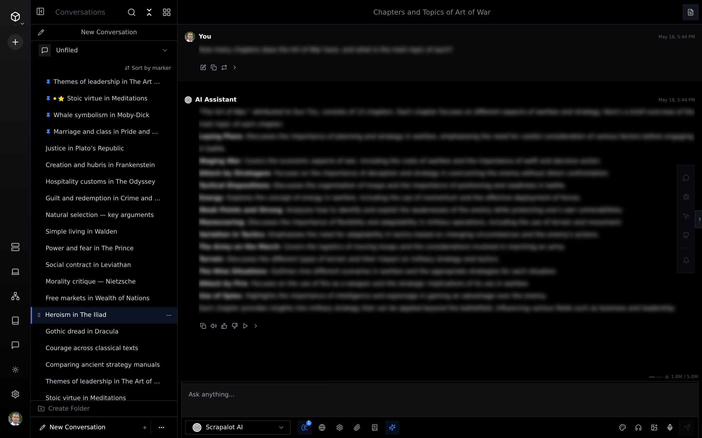
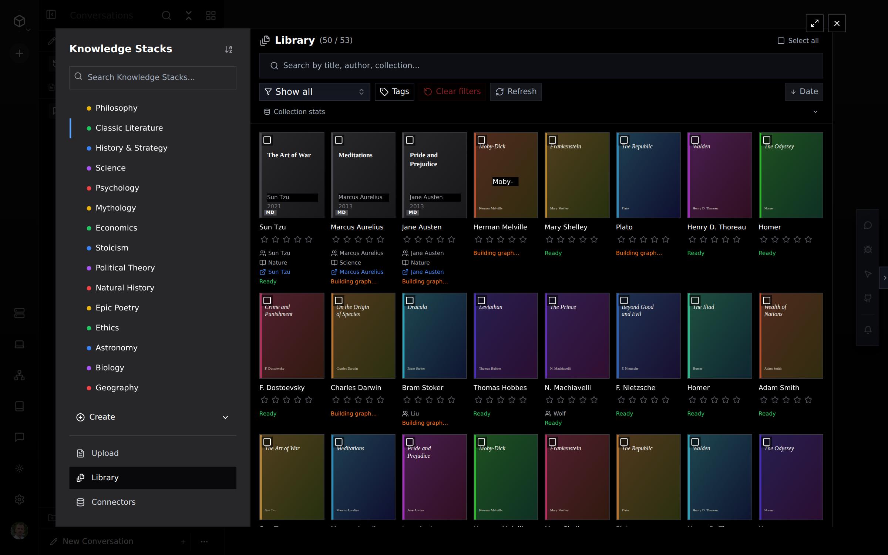
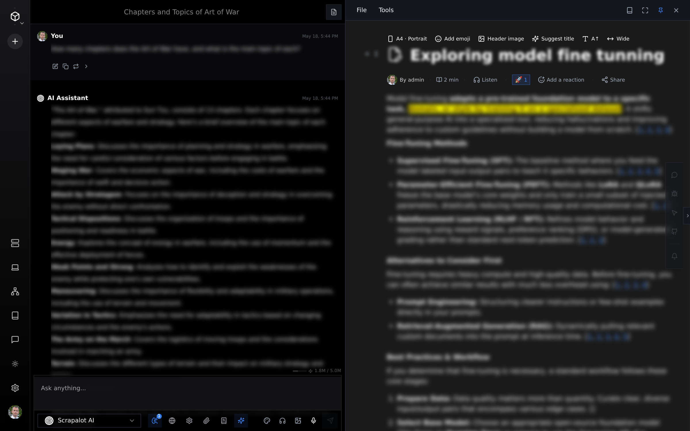
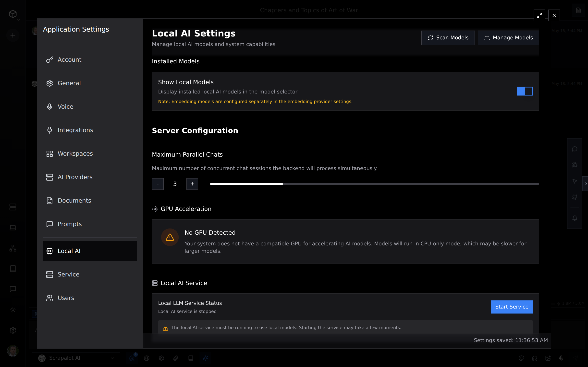
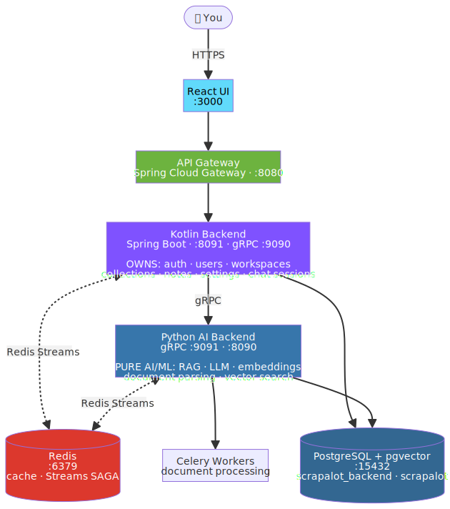

<div align="center">

# Scrapalot — Community Edition

**Self-hostable, open-core AI document RAG.**
Upload your documents, chat over them with retrieval-augmented generation, take collaborative notes — running entirely on your own infrastructure, with your own LLM keys.

[](LICENSE)
[](https://discord.gg/mmuCqzFXs7)
[](#tech-stack)
[](#tech-stack)
[](#tech-stack)
[](#quick-start)

[Quick start](#quick-start) · [Architecture](#architecture) · [Configuration](#configuration) · [Editions](#editions) · [Contributing](#contributing) · [Hosted product ↗](https://scrapalot.app)

</div>

---

## What is Scrapalot?

Scrapalot turns a pile of documents into a knowledge base you can **talk to**. Drop in PDFs (and other formats), and it parses, OCRs, chunks and embeds them, then answers your questions with citations grounded in your own corpus — not the open web. Around the chat it adds a real-time collaborative notes editor and read-aloud.

The **Community Edition** is the open-core heart of the product: a complete, self-hostable RAG stack you run with one `docker compose up`. The [hosted product](https://scrapalot.app) layers advanced research and collaboration features on top (see [Editions](#editions)).

**Bring your own key** — point it at OpenAI, Anthropic, DeepSeek, or a local GGUF model. **No usage quotas** — it runs on your hardware.

---

## Screenshots

<table>
  <tr>
    <td width="50%" valign="top">
      
      <br><sub><b>Grounded RAG chat</b> — ask questions, get answers cited from your own corpus.</sub>
    </td>
    <td width="50%" valign="top">
      
      <br><sub><b>Knowledge library</b> — organize documents into collections, ready to query.</sub>
    </td>
  </tr>
  <tr>
    <td width="50%" valign="top">
      
      <br><sub><b>Notes + chat</b> — a rich, collaborative editor right next to the conversation.</sub>
    </td>
    <td width="50%" valign="top">
      
      <br><sub><b>Local AI / BYOK</b> — bring your own key, or run a local model on your hardware.</sub>
    </td>
  </tr>
</table>

---

## Features

- 📄 **Document ingestion** — PDF + common formats, OCR, structure-aware chunking, embeddings into pgvector
- 🔎 **Hybrid RAG chat** — dense (vector) + sparse (BM25) + lexical (regex/grep) retrieval, with inline citations back to the source
- 🌐 **Web search** — augment answers with live web results
- 💬 **Conversation memory** — follow-up questions keep context
- 📝 **Collaborative notes** — real-time multi-user editor (Y.js), tied to your documents
- 🔊 **Read-aloud (TTS)** — listen to answers and documents
- 🔑 **Bring Your Own Key** — OpenAI · Anthropic · DeepSeek · local llama.cpp / GGUF inference
- 🐳 **One-command self-host** — Docker Compose, no external SaaS dependencies

---

## Architecture

Scrapalot is a small set of focused services behind a single gateway. The **Kotlin backend owns all your data and auth**; the **Python backend is a pure AI/ML worker** that never sees user tables — it receives only the IDs it needs over gRPC.

<p align="center">
  
</p>

**Request flow** — the UI never talks to the AI backend directly:

```
User → UI → Gateway → Kotlin backend ──(gRPC)──→ Python AI backend
                          │  validates JWT          │  retrieves chunks (pgvector)
                          │  checks access           │  calls the LLM
                          │  loads settings          │  streams the answer back
                          └─ owns the data           └─ owns the AI, not the data
```

**Data ownership** keeps the design clean:

| Kotlin backend (`scrapalot_backend` DB) | Python AI backend (`scrapalot` DB) |
|---|---|
| users, auth (JWT/OAuth), sessions | document content, chunks, embeddings |
| workspaces, collections, document metadata | vector + sparse + lexical retrieval |
| notes, settings, chat history | LLM calls, generation, citations |
| **source of truth for all user data** | **receives user IDs as gRPC params — never queries user tables** |

---

## Tech stack

| Layer | Technology |
|---|---|
| **Frontend** | React 18 · TypeScript · Vite · Radix UI + Tailwind (Shadcn) · STOMP WebSocket · i18next |
| **Gateway** | Kotlin · Spring Cloud Gateway · Resilience4j |
| **Backend** | Kotlin 2.1 · Spring Boot 3.4 · PostgreSQL + pgvector · Liquibase · gRPC · Redis |
| **AI backend** | Python 3.12 · gRPC · SQLAlchemy + Alembic · pgvector · LangChain · Pydantic AI · Celery |
| **Infra** | Docker Compose · PostgreSQL 18 (pgvector) · Redis 7 |

---

## Quick start

**Prerequisites:** Docker + Docker Compose, and an LLM API key (OpenAI / Anthropic / DeepSeek) or a local GGUF model.

```bash
git clone https://github.com/sime2408/scrapalot.git
cd scrapalot

# 1. Configure
cp .env.example .env
#    Edit .env and set at minimum:
#      POSTGRES_PASSWORD   — a strong database password
#      JWT_SECRET          — a random 32+ character secret
#      OPENAI_API_KEY      — your LLM key (or ANTHROPIC_API_KEY / DEEPSEEK_API_KEY)

# 2. Build and launch the whole stack
docker compose up -d --build

# 3. Watch it come up
docker compose logs -f
```

Once healthy:

| Service | URL |
|---|---|
| **Web app** | http://localhost:3000 |
| API gateway | http://localhost:8080 |
| Kotlin backend | http://localhost:8091 |
| Python AI backend | http://localhost:8090 |
| PostgreSQL | localhost:15432 |
| Redis | localhost:6379 |

> On first boot the database migrations run automatically (Liquibase for the Kotlin backend, Alembic for the Python backend) against the freshly-created `scrapalot` and `scrapalot_backend` databases.

To stop: `docker compose down` (add `-v` to also wipe the data volumes).

---

## Configuration

All configuration lives in `.env` (copied from `.env.example`). Key variables:

| Variable | Description |
|---|---|
| `POSTGRES_USER` / `POSTGRES_PASSWORD` | Database credentials (shared by both backends) |
| `JWT_SECRET` | Shared signing secret — **must be identical** across gateway, backend and AI backend; 32+ chars |
| `OPENAI_API_KEY` | Your LLM key. Also `ANTHROPIC_API_KEY`, `DEEPSEEK_API_KEY` — set whichever you use |
| `REDIS_PASSWORD` | Optional Redis password (leave blank for none) |
| `GOOGLE_OAUTH_ENABLED` | `true` to enable Google sign-in (then set client id/secret) |
| `FRONTEND_URL` | Public URL of the UI (default `http://localhost:3000`) |
| `NEO4J_ENABLED` | `false` in the Community Edition (the knowledge graph is hosted-only) |

Local model inference (llama.cpp / GGUF) needs no API key — point the app at your model in settings.

---

## Project structure

```
scrapalot/
├── chat/                # Python AI backend — gRPC, RAG, document processing, embeddings
├── backend/             # Kotlin backend — auth, users, workspaces, collections, notes, settings
├── ui/                  # React frontend — chat, notes, knowledge, settings
├── gw/                  # API gateway — Spring Cloud Gateway
├── docker/              # DB init scripts
├── docker-compose.yml   # One-command self-host stack
└── .env.example         # Configuration template
```

Each module keeps its own `docs/` and developer notes.

---

## Development

Run the full stack with Compose (above), then iterate on a single module:

```bash
# Python AI backend (hot-reloads in the container)
docker compose logs -f chat

# Kotlin backend
cd backend && ./gradlew build

# Frontend
cd ui && npm install && npm run dev      # dev server on :3000
```

- **Python** changes hot-reload, **except** gRPC service files (`chat/src/main/grpc/services/*.py`) which need a `chat` container restart.
- **Kotlin** and **frontend** changes require a rebuild (`docker compose up -d --build <service>`).

---

## Editions

Scrapalot is **open-core**. The Community Edition is fully functional and self-hostable; the [hosted product](https://scrapalot.app) adds research- and team-grade features.

| | **Community Edition** (this repo, AGPL-3.0) | **Hosted / Pro** ([scrapalot.app](https://scrapalot.app)) |
|---|:---:|:---:|
| Document ingestion + OCR + embeddings | ✅ | ✅ |
| Hybrid RAG chat (vector + BM25 + lexical) | ✅ | ✅ |
| Collaborative notes · TTS · web search · BYOK | ✅ | ✅ |
| Self-host, no usage quotas | ✅ | — |
| Advanced RAG (fusion, agentic routing, reranking) | — | ✅ |
| Deep Research (multi-agent, 5-phase) | — | ✅ |
| Knowledge Graph (Neo4j entity linking) | — | ✅ |
| AI Scientist papers · Notes AI assistant | — | ✅ |
| Voice chat / STT · image generation · MCP | — | ✅ |
| Team chat, shared workspaces, external connectors | — | ✅ |
| Programmatic API access · Android app | — | ✅ |

Running the hosted modules against your own deployment is not part of the Community Edition — but everything above the divider is yours to run, modify and self-host under the AGPL.

---

## Contributing

Contributions are welcome. Please:

1. Open an issue or hop into [Discord](https://discord.gg/mmuCqzFXs7) to discuss substantial changes first.
2. Fork, branch, and keep changes focused. Match the surrounding code style.
3. Make sure the stack still builds: Kotlin/gateway compile, the UI builds (`npm run build`), and the Python backend imports cleanly.
4. Open a pull request describing what and why.

By contributing you agree your contributions are licensed under AGPL-3.0.

---

## Community

- 💬 **Discord** — [join the community](https://discord.gg/mmuCqzFXs7) for help, ideas and discussion
- 🐛 **Issues** — bug reports and feature requests via [GitHub Issues](https://github.com/sime2408/scrapalot/issues)
- ☁️ **Hosted product** — [scrapalot.app](https://scrapalot.app)

---

## License

Scrapalot Community Edition is licensed under the **GNU Affero General Public License v3.0** ([AGPL-3.0](LICENSE)).

In short: you are free to use, modify and self-host it. If you run a modified version as a network service, you must make your modified source available to its users. The hosted Scrapalot product and its proprietary modules are not covered by this license.
