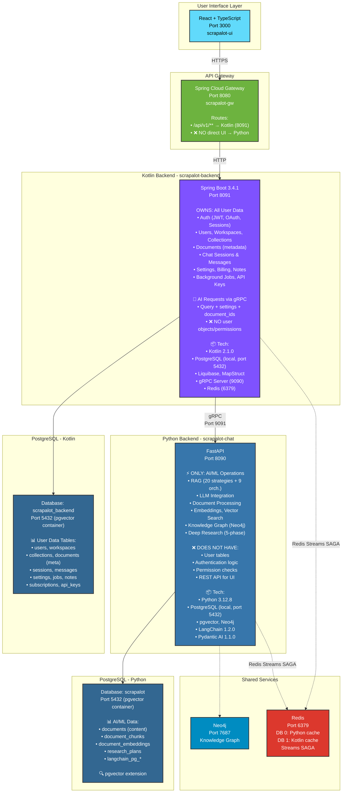
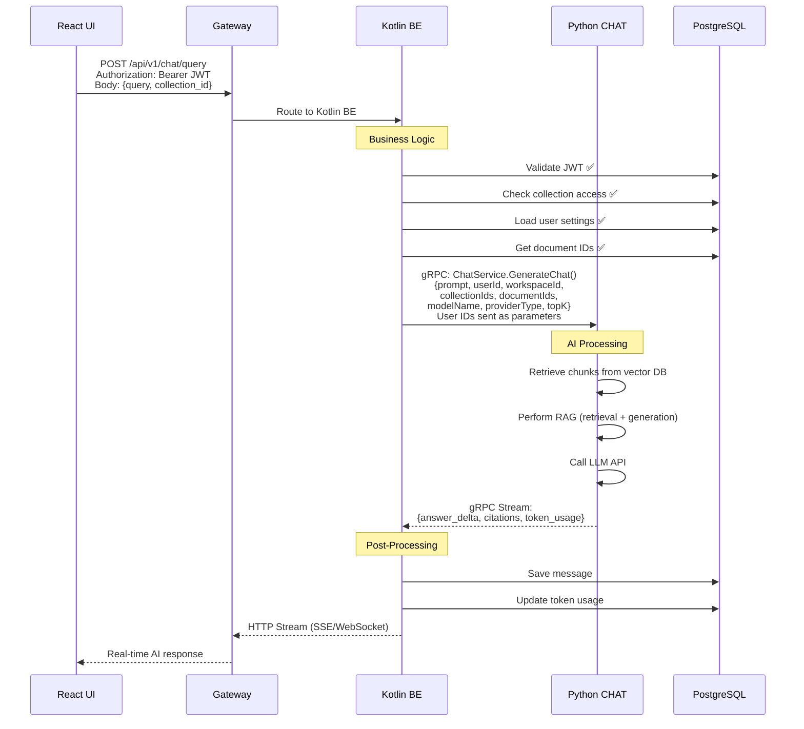
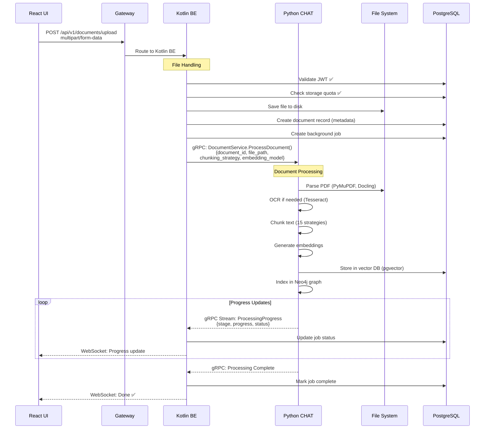
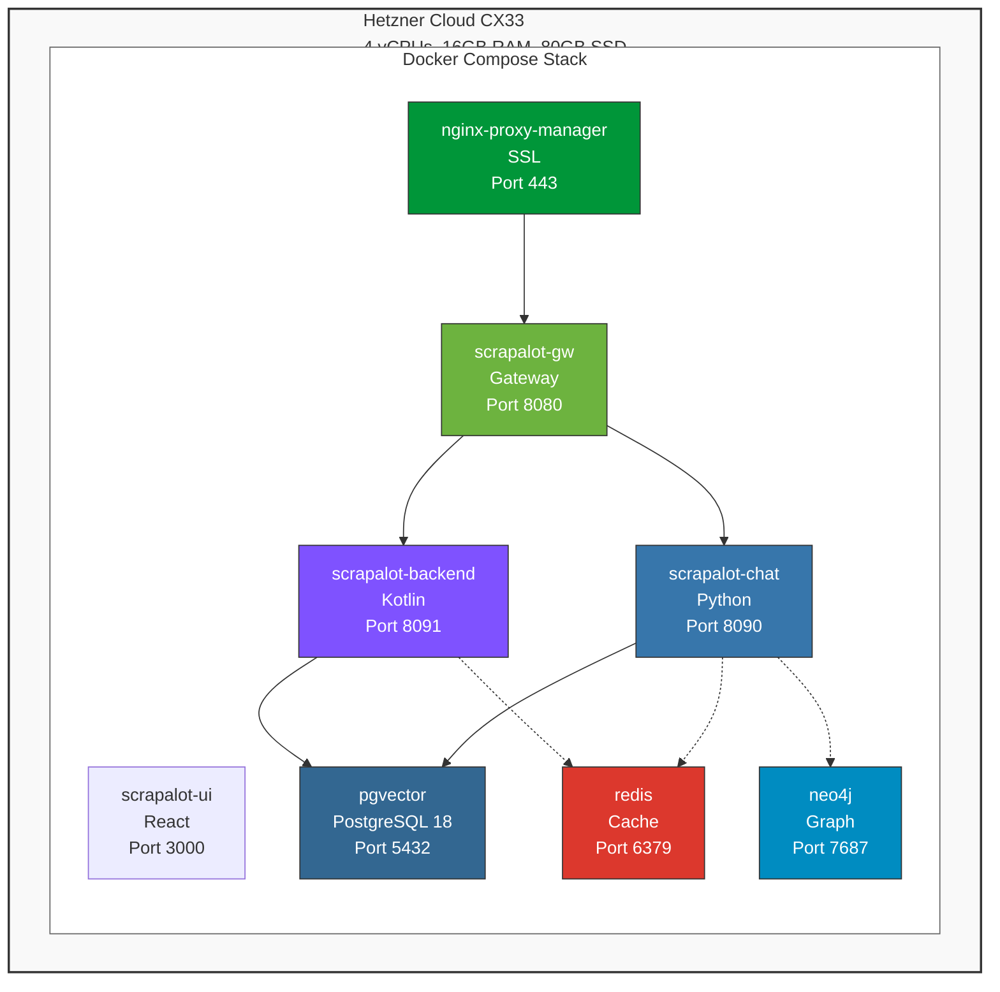
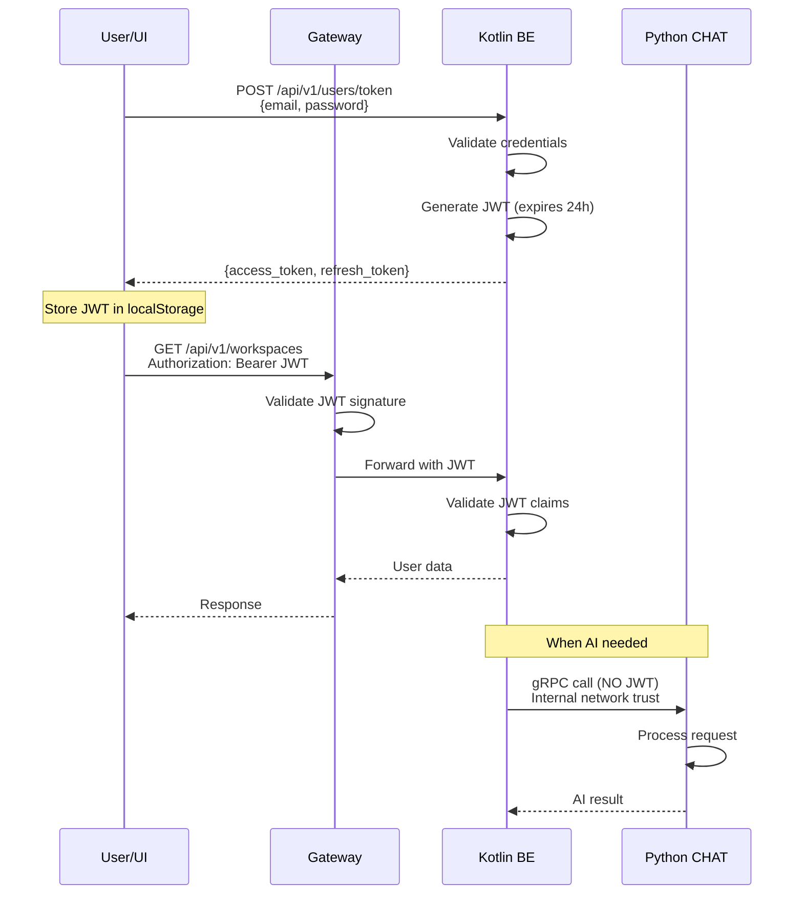

# Scrapalot System Architecture

**Version**: 3.0.0
**Last Updated**: March 2026
**Status**: Migration COMPLETE

---

## 🏗️ System Architecture Overview

### Architecture Principles

**1. Separation of Concerns**
- **Kotlin Backend**: OWNS all user data, auth, business logic
- **Python Backend**: PURE AI/ML service (RAG, LLM, embeddings)
- **Gateway**: Single entry point for all UI requests

**2. Request Flow**
```
UI → Gateway → Kotlin BE → gRPC → Python CHAT (when AI needed)
```

**3. Data Ownership**
- **Kotlin Backend** (`scrapalot_backend` database):
  - OWNS: users, workspaces, workspace_users, collections, documents (metadata)
  - OWNS: sessions, messages, notes, settings, subscriptions, api_keys, jobs
  - RESPONSIBLE: Authentication, authorization, business logic, data validation

- **Python CHAT** (`scrapalot` database):
  - OWNS: documents (content/binary), document_chunks, document_embeddings
  - OWNS: research_plans, research_tasks, research_sources, langchain_pg_*
  - RESPONSIBLE: AI/ML operations ONLY (RAG, LLM, embeddings, research)
  - ❌ DOES NOT OWN: User data (receives via gRPC parameters)

**4. gRPC Communication Pattern**
- **Kotlin → Python**: Sends user context (userId, workspaceId, collectionIds) as gRPC parameters
- **Python**: Receives user IDs, NEVER queries user tables directly
- **Example**: `ChatService.GenerateChat(prompt="...", userId="uuid", workspaceId="uuid", documentIds=["uuid1", "uuid2"])`

---

## 📊 High-Level Architecture



---

## 🔄 Communication Patterns

### 1. Normal Flow: User Asks AI Question



### 2. Document Upload Flow



### 3. Python Initiates Action (Rare)

```mermaid
sequenceDiagram
    participant PY as Python CHAT
    participant KB as Kotlin BE
    participant DB as PostgreSQL
    participant UI as React UI

    Note over PY: Async job completes

    PY->>KB: Redis Stream (P→K): job status update<br/>{job_id, status, result_json}<br/>(no Python→Kotlin gRPC; Kotlin can also poll JobsService.GetJobStatus)

    KB->>DB: Update job record (replica)
    KB->>DB: Publish event to Redis
    KB-->>UI: WebSocket: Job status update
```

---

## 📦 Service Boundaries

### Kotlin Backend Responsibilities

**IMPLEMENTATION STATUS** (April 2026 - Migration COMPLETE):
- **50 REST Controllers** - Full CRUD API implementation
- **42 Services** - Complete business logic layer
- **37 Domain Entities** - Comprehensive data model
- **37 Repositories** - Spring Data JPA repositories
- **27 Proto Definitions** - gRPC service contracts
- **19 gRPC Clients** - Kotlin calls Python AI services via gRPC
- **69 Liquibase Migrations** - Database schema management (up to 129-owner-superadmin)

**OWNS:**
- User authentication (JWT, OAuth, sessions)
- User management (CRUD, permissions)
- Workspace management (CRUD, sharing)
- Collection management (CRUD, organization)
- Document metadata (upload tracking, ownership)
- Chat history (sessions, messages)
- Settings (user preferences, system config)
- Subscriptions & billing
- Notes & collaboration
- Background job tracking
- API key management
- Reading position tracking (PDF/EPUB)
- External connectors (OAuth, sync jobs)

**PROVIDES:**
- REST API for UI (all endpoints)
- gRPC clients for Python AI services (19 clients)
- WebSocket server (real-time notifications)
- Redis Streams SAGA (cross-service sync with guaranteed delivery)

**🔧 CALLS Python FOR:**
- RAG queries (when user asks AI)
- Document processing (when file uploaded)
- Embedding generation (for semantic search)

---

### Kotlin Backend Implementation Details

#### 📋 REST Controllers (50 Total)

| Controller | Endpoints | Description |
|------------|-----------|-------------|
| **AdminController** | `/api/v1/admin/*` | Admin operations |
| **AdminDebugController** | `/api/v1/admin/debug/*` | Admin debug utilities |
| **AdminEmailController** | `/api/v1/admin/email/*` | Admin email management |
| **AdminInspectorController** | `/api/v1/admin/inspector/*` | RAG tracing, LLM traces |
| **AnnotationController** | `/api/v1/annotations/*` | Document annotations |
| **AuthController** | `/api/v1/auth/*` | Registration, login, JWT token generation |
| **ChatController** | `/api/v1/chat/*` | Chat generation (gRPC → Python) |
| **CollectionController** | `/api/v1/collections/*` | Collection CRUD, document organization |
| **ConnectorController** | `/api/v1/connectors/*` | External connector management |
| **ContactController** | `/api/v1/contact/*` | Contact form |
| **DesktopController** | `/api/v1/desktop/*` | Desktop app endpoints |
| **DocumentController** | `/api/v1/documents/*` | Document metadata, upload tracking |
| **ExternalBooksController** | `/api/v1/external-books/*` | External book search |
| **InvitationController** | `/api/v1/invitations/*` | User invitation management |
| **JobController** | `/api/v1/jobs/*` | Background job tracking |
| **KnowledgeController** | `/api/v1/knowledge/*` | Knowledge base operations |
| **LlmInferenceController** | `/api/v1/llm/*` | LLM inference proxy |
| **LoginController** | `/api/v1/login` | Login endpoint |
| **MessageController** | `/api/v1/messages/*` | Chat message CRUD, history |
| **MetadataController** | `/api/v1/metadata/*` | Document metadata extraction |
| **NoteCollaborationController** | `/api/v1/notes/collaboration/*` | Real-time note editing |
| **NoteController** | `/api/v1/notes/*` | Note CRUD, versioning |
| **OpenApiController** | `/v3/api-docs` | OpenAPI documentation |
| **ResearchController** | `/api/v1/research/*` | Deep research operations |
| **SessionController** | `/api/v1/sessions/*` | Chat session management |
| **SessionFolderController** | `/api/v1/session-folders/*` | Session folder management |
| **SessionShareController** | `/api/v1/session-shares/*` | Session sharing |
| **SettingsController** | `/api/v1/settings/*` | User/server settings management |
| **SimpleLoginController** | `/api/v1/simple-login` | Simplified login flow |
| **StaticFileController** | `/static/*` | Static file serving |
| **StorageController** | `/api/v1/storage/*` | File storage management |
| **SttController** | `/api/v1/stt/*` | Speech-to-text |
| **SubscriptionsController** | `/api/v1/subscriptions/*` | Subscription plans, billing, Stripe |
| **TagController** | `/api/v1/tags/*` | Document tagging |
| **TestController** | `/api/v1/test/*` | Development testing endpoints |
| **TokenController** | `/api/v1/tokens/*` | API key management |
| **TtsController** | `/api/v1/tts/*` | Text-to-speech |
| **UserController** | `/api/v1/users/*` | User CRUD, profile management, permissions |
| **WorkspaceChatController** | `/api/v1/workspace-chat/*` | Workspace-level chat |
| **WorkspaceController** | `/api/v1/workspaces/*` | Workspace CRUD, sharing, member management |
| **YouTubeController** | `/api/v1/youtube/*` | YouTube integration |

#### 🔧 Business Services (42 Total)

| Service | Responsibility |
|---------|----------------|
| **AnnotationService** | Document annotation management |
| **APIKeyService** | API key generation, validation |
| **AuthService** | Authentication, JWT token generation, OAuth validation |
| **ChatService** | gRPC communication with Python (chat generation) |
| **CollectionService** | Collection CRUD, document organization |
| **CollectionWorkspaceSyncService** | Redis Streams collection-workspace sync |
| **ConnectorService** | External connector management |
| **ConnectorSyncSnapshotService** | Redis snapshot for connector sync |
| **DockerService** | Docker container management (dev environment) |
| **EmailService** | Email sending via Mailgun |
| **GoogleOAuthService** | Google OAuth 2.0 integration |
| **InvitationTokenService** | User invitation token management |
| **MessageService** | Message persistence, history retrieval |
| **MetadataResolverService** | Document metadata resolution |
| **ModelProviderService** | Model provider CRUD |
| **ModelProviderSyncService** | Redis Streams model provider sync (Python → Kotlin) |
| **NoteService** | Note CRUD, versioning, collaboration |
| **RefreshTokenService** | JWT refresh token management |
| **SessionFolderService** | Session folder organization |
| **SessionService** | Chat session lifecycle |
| **SessionShareService** | Session sharing management |
| **SettingsService** | User/server settings management |
| **StripeService** | Stripe payment processing |
| **SubscriptionService** | Subscription management, billing |
| **TokenUsageService** | Token usage tracking (Redis Streams from Python) |
| **UserService** | User CRUD, permission checks, profile management |
| **WorkspaceChatService** | Workspace-level chat management |
| **WorkspaceService** | Workspace CRUD, member management, sharing |

#### 🗄️ Domain Entities (37 Total)

**Core Entities:**
- **User** - User accounts, authentication
- **Workspace** - User workspaces, multi-tenancy
- **WorkspaceUser** - Workspace membership, roles
- **Collection** - Document collections
- **Session** - Chat sessions
- **SessionFolder** - Session folder organization
- **SessionShare** - Session sharing permissions
- **Message** - Chat messages
- **Annotation** - Document annotations
- **InvitationToken** - User invitation tokens

**Notes:**
- **Note** - Collaborative notes
- **NoteVersion** - Note version history
- **NoteShare** - Note sharing permissions
- **NoteComment** - Note comments

**Settings & Configuration:**
- **UserSetting** - User preferences (JSON)
- **ServerSetting** - Server configuration (JSON)

**Subscriptions & Billing:**
- **SubscriptionPlan** - Subscription tiers
- **UserSubscription** - User subscription status
- **UserTokenUsage** - Token usage tracking
- **APIKey** - API keys for programmatic access

**External Connectors & Models:**
- **Connector** - External service connectors
- **ConnectorSyncDestination** - Sync destination configuration
- **ModelProvider** - LLM model providers (synced from Python)
- **ModelProviderModel** - Provider model definitions (synced from Python)

**Workspace Chat:**
- **WorkspaceChatMessage** - Workspace-level chat messages
- **WorkspaceChatPresence** - User presence tracking

#### 📦 Spring Data Repositories (37 Total)

All repositories extend `JpaRepository<Entity, UUID>` with custom query methods:

- AnnotationRepository
- APIKeyRepository
- CollectionRepository
- ConnectorRepository
- ConnectorSyncDestinationRepository
- InvitationTokenRepository
- MessageRepository
- ModelProviderModelRepository
- ModelProviderRepository
- NoteCommentRepository
- NoteRepository
- NoteShareRepository
- NoteVersionRepository
- ServerSettingRepository
- SessionFolderRepository
- SessionRepository
- SessionShareRepository
- SubscriptionPlanRepository
- UserRepository
- UserSettingRepository
- UserSubscriptionRepository
- UserTokenUsageRepository
- WorkspaceChatMessageRepository
- WorkspaceChatPresenceRepository
- WorkspaceRepository
- WorkspaceUserRepository

#### 🔌 gRPC Clients (19 Total)

**Kotlin gRPC Clients (Port 9091)** - Kotlin calls Python gRPC SERVER for AI operations:

| Client | Proto File | Purpose |
|--------|------------|---------|
| **AdminGrpcClient** | `admin.proto` | Admin operations (graph rebuild, etc.) |
| **ChatGrpcClient** | `chat.proto` | Chat generation, RAG queries |
| **CollectionAIGrpcClient** | `collection_ai.proto` | Collection AI operations |
| **ConnectorGrpcClient** | `connectors.proto` | Connector sync operations |
| **DesktopGrpcClient** | `desktop.proto` | Desktop app operations |
| **DocumentCollectionGrpcClient** | `collection_service.proto` | Document collection access |
| **DocumentExtrasGrpcClient** | `document_extras.proto` | Document extras (summaries, relations) |
| **DocumentProcessingGrpcClient** | `documents.proto` | Document processing, embeddings |
| **ExternalBooksGrpcClient** | `external_books.proto` | External book search |
| **InspectionGrpcClient** | `inspection.proto` | RAG tracing, LLM traces |
| **JobsGrpcClient** | `jobs.proto` | Background job tracking |
| **LlmInferenceGrpcClient** | `llm_inference.proto` | LLM inference proxy |
| **NotesAssistantGrpcClient** | `notes_assistant.proto` | Notes AI assistant operations |
| **PaperGrpcClient** | `paper.proto` | Academic paper generation |
| **ResearchGrpcClient** | `research.proto` | Deep research orchestration |
| **SettingsAIGrpcClient** | `settings_ai.proto` | Model providers, SyncUserSetting |
| **SttGrpcClient** | `stt.proto` | Speech-to-text |
| **TtsGrpcClient** | `tts.proto` | Text-to-speech |

**Proto Definitions** (27 Total):
- `admin.proto` - Admin operations
- `annotations.proto` - Document annotations
- `auth_service.proto` - Authentication services
- `chat.proto` - Chat generation (Kotlin → Python)
- `collection_ai.proto` - Collection AI operations
- `collection_service.proto` - Collection services
- `common.proto` - Common message types
- `connectors.proto` - Connector operations
- `desktop.proto` - Desktop app services
- `document_extras.proto` - Document extras (summaries, relations)
- `documents.proto` - Document processing (Kotlin → Python)
- `events_service.proto` - Event streaming
- `external_books.proto` - External book search
- `inspection.proto` - RAG tracing, LLM traces
- `jobs.proto` - Background job tracking
- `llm_inference.proto` - LLM inference
- `mcp.proto` - MCP server operations
- `notes_assistant.proto` - Notes AI assistant
- `notes_service.proto` - Notes services
- `paper.proto` - Academic paper generation
- `research.proto` - Deep research
- `settings_ai.proto` - AI settings, model providers
- `settings_service.proto` - Settings services
- `stt.proto` - Speech-to-text
- `subscription_service.proto` - Subscription services
- `tts.proto` - Text-to-speech
- `workspace_service.proto` - Workspace services

### Python Backend Responsibilities

**OWNS:**
- RAG strategies & orchestrators
- LLM integration (OpenAI, Anthropic, etc.)
- Document processing (parsing, OCR, chunking)
- Embedding generation (OpenAI, HuggingFace)
- Vector search (pgvector queries)
- Knowledge graph (Neo4j integration)
- Deep research system
- Document content storage

**PROVIDES:**
- gRPC server (AI operations)
- Vector search capabilities
- LLM inference
- Document processing pipeline

**❌ DOES NOT:**
- Store user data (no user tables in database)
- Perform authentication (no JWT validation)
- Check permissions (no access control)
- Manage business logic (no subscriptions)
- Query user/workspace/collection tables

**RECEIVES via gRPC:**
- User IDs (userId, workspaceId, collectionIds) as function parameters
- Uses IDs for logging, analytics, per-user caching
- NEVER queries user tables - trusts Kotlin's authorization

**MIGRATION COMPLETE:**
- Python serves ONLY gRPC (port 9091) + WebSocket (notes collaboration) + health endpoint
- Zero REST routes remain in Python
- All user-facing endpoints route through Kotlin Backend

---

## 🔌 Inter-Service Communication

### gRPC Services

**Kotlin → Python (AI Requests):** defined in `chat.proto` as `ChatService` (12 RPCs).
```protobuf
service ChatService {
  rpc GenerateDirectLLM(DirectLLMRequest) returns (stream ChatResponsePacket);
  rpc GenerateRAG(RAGRequest) returns (stream ChatResponsePacket);
  rpc GenerateDeepResearch(DeepResearchRequest) returns (stream ChatResponsePacket);
  rpc GenerateWebSearch(WebSearchRequest) returns (stream ChatResponsePacket);
  rpc GenerateAgenticRAG(AgenticRAGRequest) returns (stream ChatResponsePacket);
  rpc GenerateDocumentQA(DocumentQARequest) returns (stream ChatResponsePacket);
  rpc GenerateTitle(TitleRequest) returns (TitleResponse);
  rpc GenerateChat(ChatRequest) returns (stream ChatResponsePacket);
  rpc GenerateChatTutor(TutorChatRequest) returns (stream ChatResponsePacket);
  rpc GetTutorProgress(GetTutorProgressRequest) returns (TutorProgressResponse);
  rpc GenerateImage(GenerateImageRequest) returns (stream ChatResponsePacket);
  rpc HealthCheck(scrapalot.common.Empty) returns (HealthCheckResponse);
}

// Request message with user context (fields 1-19 shown abbreviated)
message ChatRequest {
  string prompt = 1;                       // User's question
  optional string session_id = 2;          // Chat session UUID
  string user_id = 3;                       // User UUID (for logging/caching)
  optional string workspace_id = 4;         // Workspace UUID (for scoping)
  repeated string collection_ids = 5;       // Collection UUIDs (for filtering)
  repeated string document_ids = 6;         // Document UUIDs (for RAG retrieval)
  optional string model_id = 7;             // Provider model id
  optional string model_name = 8;           // Model name
  optional string provider_type = 9;        // Provider type
  string language = 10;                     // Response language
  // ... web_search_enabled, deep_research_enabled, research_breadth/depth, top_k, etc.
}

// Streaming response packet
message ChatResponsePacket {
  string type = 1;                          // packet type (e.g. "message_delta", "citation", "status")
  int32 index = 2;                          // packet ordinal
  string data = 3;                          // JSON-encoded packet payload
  scrapalot.common.Timestamp timestamp = 4; // emission time
}
```

Note: document processing lives in `DocumentProcessingService` (`documents.proto`), not `ChatService`; there is no `GenerateEmbeddings` RPC.

**Kotlin → Python (Job Tracking):** defined in `jobs.proto` as `JobsService`.
```protobuf
service JobsService {
  rpc GetActiveJobs(GetActiveJobsRequest) returns (GetActiveJobsResponse);
  rpc GetJobStatus(GetJobStatusRequest) returns (JobStatusResponse);
  rpc CancelJob(CancelJobRequest) returns (scrapalot.common.StatusResponse);
}
```

### Redis Streams SAGA (Cross-Service Sync)

**Streams (XADD/XREADGROUP with consumer groups for guaranteed delivery):**

| Stream | Direction | Consumer Group | SAGA | Purpose |
|--------|-----------|----------------|------|---------|
| `scrapalot:stream:collections` | K->P | `cg-scrapalot-chat` | No | Collection CRUD |
| `scrapalot:stream:workspaces` | K->P | `cg-scrapalot-chat` | No | Workspace CRUD |
| `scrapalot:stream:connectors` | K->P | `cg-scrapalot-chat` | No | Connector CRUD |
| `scrapalot:stream:user_settings` | K->P | `cg-scrapalot-chat` | Yes | User setting sync |
| `scrapalot:stream:model_providers` | P->K | `cg-scrapalot-backend` | Yes | Model provider CRUD |
| `scrapalot:stream:token_usage` | P->K | `cg-scrapalot-backend` | No | Token usage tracking |
| `scrapalot:stream:saga_ack` | Both | Both | - | SAGA acknowledgements |

**SAGA Pattern**: Remote DB commits FIRST -> ACK via saga_ack stream -> Local DB commits. Timeout 10s -> 503.

**Legacy Pub/Sub** (retained for gRPC streaming fan-out):

| Channel | Purpose |
|---------|---------|
| `scrapalot:events:documents` | Document upload events |
| `scrapalot:events:notes` | Note collaboration events |
| `scrapalot:events:settings` | Settings change notifications |
| `scrapalot:events:all` | Catch-all for gRPC streaming |

---

## 🗄️ Database Architecture

### Database Separation

**Kotlin Database (`scrapalot_backend`):**
- **Purpose**: User management, business logic
- **Port**: 5432 (pgvector container)
- **Schema**: `scrapalot`
- **Size**: ~500MB (user data)
- **Backup**: Daily snapshots

**Complete Table List** (23 entities):

**Core Tables:**
- `users` - User accounts, authentication
- `workspaces` - User workspaces
- `workspace_users` - Workspace membership
- `collections` - Document collections
- `documents` - Document metadata
- `sessions` - Chat sessions
- `messages` - Chat messages

**Collaboration Tables:**
- `notes` - Collaborative notes
- `note_versions` - Version history
- `note_shares` - Sharing permissions
- `note_comments` - Note comments

**Settings Tables:**
- `user_settings` - User preferences (JSONB)
- `server_settings` - Server config (JSONB)

**Billing Tables:**
- `subscription_plans` - Plan definitions
- `user_subscriptions` - User subscription status
- `api_keys` - API keys for programmatic access

**Features Tables:**
- `reading_positions` - PDF/EPUB reading positions

**Connector Tables:**
- `connectors` - External service definitions
- `connector_credentials` - OAuth credentials
- `connector_oauth_state` - OAuth flow state
- `connector_sync_jobs` - Background sync jobs
- `connector_file_sync` - File sync metadata
- `connector_sync_destination` - Sync destinations

**Python Database (`scrapalot`):**
- **Purpose**: AI/ML data storage
- **Port**: 5432 (pgvector container)
- **Schema**: `scrapalot`
- **Size**: ~10GB+ (document content, embeddings)
- **Backup**: Weekly snapshots + point-in-time recovery

**Note**: Both databases run on the same PostgreSQL instance (pgvector Docker container) but use different database names for separation.

### Migration Tools

**Kotlin (Liquibase):**
```yaml
# Location: src/main/resources/db/changelog/changes/
# Format: 001-create-users-table.yaml
# Command: ./gradlew update
```

**Python (Alembic):**
```python
# Location: alembic/versions/
# Format: 001_create_documents_table.py
# Command: alembic upgrade head
```

---

## 🚀 Deployment Architecture



### Port Allocation

| Service | Port | Purpose |
|---------|------|---------|
| nginx-proxy-manager | 443/80 | SSL termination, reverse proxy |
| scrapalot-ui | 3000 | React frontend |
| scrapalot-gw | 8080 | API Gateway |
| scrapalot-backend | 8091 | Kotlin REST API |
| scrapalot-backend | 9090 | Kotlin gRPC Server |
| scrapalot-chat | 8090 | Python (health + WebSocket only) |
| scrapalot-chat | 9091 | Python gRPC Server |
| redis | 6379 | Cache + Redis Streams SAGA |
| neo4j | 7687 | Knowledge graph |
| pgvector | 5432 | PostgreSQL (both databases) |

---

## 📈 Scalability

### Horizontal Scaling

**Stateless Services (Easy):**
- Kotlin Backend (multiple instances behind load balancer)
- Python Backend (multiple instances, gRPC load balancing)
- Gateway (multiple instances)

**Stateful Services (Managed):**
- PostgreSQL: Local with read replicas or external managed service
- Redis: Redis Cluster or Sentinel
- Neo4j: Enterprise clustering

### Performance Targets

| Metric | Target | Current |
|--------|--------|---------|
| RAG Query Latency | < 2s (p95) | ~1.5s |
| Document Processing | < 30s per page | ~10s |
| gRPC Call Latency | < 50ms (p99) | ~20ms |
| API Response Time | < 200ms (p95) | ~150ms |
| WebSocket Latency | < 100ms | ~50ms |

---

## 🔒 Security

### Authentication Flow



### Security Layers

**1. Network Security:**
- Hetzner Cloud firewall (only 443, 80 exposed)
- Internal Docker network (services isolated)
- gRPC TLS (production only)

**2. Application Security:**
- JWT with 256-bit secret
- OAuth 2.0 for Google/GitHub
- API key validation (for programmatic access)
- Rate limiting (Redis-based)

**3. Database Security:**
- PostgreSQL Row-Level Security (RLS)
- Connection pooling (max 30 connections)
- Encrypted connections (SSL in production)

**4. Data Security:**
- Passwords hashed (bcrypt)
- API keys encrypted at rest
- User data encrypted in transit (HTTPS)

---

## 📊 Monitoring & Observability

### Metrics

**Application Metrics:**
- Request rate, latency (p50, p95, p99)
- Error rate, status code distribution
- gRPC call latency
- LLM API usage (tokens, cost)

**Infrastructure Metrics:**
- CPU, memory, disk usage
- Database connection pool
- Redis cache hit rate
- Docker container health

**Business Metrics:**
- Active users (DAU, MAU)
- RAG queries per user
- Document processing volume
- Subscription conversions

### Logging

**Kotlin Backend:**
- Logback + SLF4J
- JSON structured logs
- Log levels: DEBUG, INFO, WARN, ERROR

**Python Backend:**
- Python logging module
- Structured JSON logs
- Correlation IDs for request tracing

### Alerting

**Critical Alerts:**
- Service down (health check fails)
- Database connection errors
- LLM API failures
- gRPC communication errors

**Warning Alerts:**
- High latency (> 2s)
- High error rate (> 1%)
- Disk space low (> 80%)
- Memory usage high (> 90%)

---

## 🔄 Migration Status & Implementation Plan

**Current State** (March 2026):

### Migration COMPLETE ✅

The Python-to-Kotlin migration was completed in Q1 2026. All phases have been successfully delivered:

- **50 REST Controllers** - Full CRUD API implementation
- **42 Business Services** - Complete business logic layer
- **19 gRPC Clients** - Kotlin calls Python AI services via gRPC (port 9091)
- **69 Liquibase Migrations** - Database schema management
- **Redis Streams SAGA** - Cross-service sync with guaranteed delivery
- Python serves ONLY gRPC + WebSocket (notes collaboration) + health
- Zero REST routes remain in Python
- All user-facing endpoints route through Kotlin Backend
- 103 E2E tests passing across 9 areas

**See**: [README_GRPC_ARCHITECTURE.md](./README_GRPC_ARCHITECTURE.md) for detailed gRPC implementation guide.

---

## 📚 Related Documentation

- [README_MIGRATION_PRD_USER_ABSTRACTION.md](./README_MIGRATION_PRD_USER_ABSTRACTION.md) - Migration PRD
- [README_GRPC_ARCHITECTURE.md](./README_GRPC_ARCHITECTURE.md) - Inter-service communication
- [README_DEPLOYMENT_GUIDE.md](./README_DEPLOYMENT_GUIDE.md) - Deployment procedures
- [README_NGINX_ROUTING.md](../../scrapalot-gw/docs/README_NGINX_ROUTING.md) - Nginx/Gateway routing
- [README_WEBSOCKET_INTEGRATION.md](./README_WEBSOCKET_INTEGRATION.md) - WebSocket architecture

---

---

## 🛠️ Technology Stack

### Kotlin Backend

**Core Framework:**
- **Kotlin**: 2.1.0 (with context receivers enabled)
- **Spring Boot**: 3.4.1
- **Java**: 21 LTS
- **Gradle**: 8.12

**Spring Boot Starters:**
- `spring-boot-starter-web` - REST API
- `spring-boot-starter-webflux` - Reactive HTTP client
- `spring-boot-starter-data-jpa` - Database access
- `spring-boot-starter-security` - Authentication
- `spring-boot-starter-validation` - Input validation
- `spring-boot-starter-websocket` - WebSocket support
- `spring-boot-starter-actuator` - Health checks
- `spring-boot-starter-data-redis` - Redis integration

**Database:**
- **PostgreSQL**: 18 (pgvector container)
- **Liquibase**: 4.30.0 - Database migrations
- **Hypersistence Utils**: 3.9.0 - JSONB support

**gRPC:**
- **gRPC Server**: net.devh:grpc-server-spring-boot-starter:3.1.0
- **gRPC Client**: net.devh:grpc-client-spring-boot-starter:3.1.0
- **gRPC Kotlin Stub**: io.grpc:grpc-kotlin-stub:1.4.1
- **gRPC Core**: io.grpc:grpc-*:1.62.2 (protobuf, stub, netty)
- **Protobuf**: com.google.protobuf:protobuf-kotlin:3.25.3

**Security:**
- **JWT**: io.jsonwebtoken:jjwt:0.12.6
- **OAuth**: com.google.api-client:google-api-client:2.7.0
- **BCrypt**: Spring Security Crypto

**Mapping & Serialization:**
- **MapStruct**: 1.6.3 - DTO/Entity mapping
- **Jackson Kotlin Module**: JSON serialization

**Logging:**
- **Kotlin Logging**: io.github.microutils:kotlin-logging-jvm:3.0.5
- **Logback**: Default Spring Boot logging

**API Documentation:**
- **Springdoc OpenAPI**: 2.7.0 (WebFlux version)
- **Swagger UI**: Included in Springdoc

**External Integrations:**
- **Stripe**: Subscription billing
- **Google OAuth**: Authentication
- **Redis**: Lettuce client (Streams SAGA, caching)

**Development Tools:**
- **Spring Boot DevTools**: Hot reload
- **Lombok**: Code generation (optional)

**Testing:**
- **JUnit 5**: Unit testing
- **MockK**: 1.13.14 - Kotlin mocking
- **Spring MockMVC**: Integration testing
- **Testcontainers**: 1.20.4 - Database testing

---

**Version**: 3.0.0
**Last Updated**: March 2026
**Status**: Migration COMPLETE
