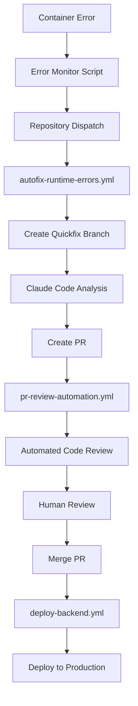
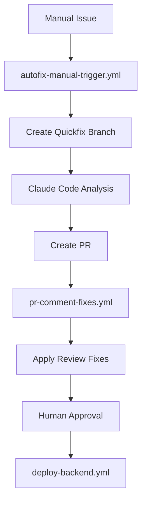

# GitHub Actions Workflows

This directory contains organized CI/CD and automation workflows for Scrapalot Chat.

## 📁 Workflow Organization

**Naming Convention**: `purpose-description.yml` for clear identification and intent.

## 🚀 Deployment Workflows

### 1. Backend Deployment (`deploy-backend.yml`)

**Purpose**: Deploy the Scrapalot Chat application and background workers.

**When to run**:
- **After** infrastructure services are deployed  
- **Every time** you want to deploy application updates
- **Automatically** on push to main branch (when backend files change)

**Features**:
- Smart path filtering (only runs when relevant files change)
- Prevents empty workflow runs (no more spam emails!)
- Automatic error detection and PR creation
- Health check monitoring
- Background worker deployment

**Trigger options**:
- Manual: Actions tab → Run workflow
- Automatic: Push to main branch with backend file changes

**Inputs**:
- `environment`: Deployment environment (dev/rc/prod)
- `enable_workers`: Deploy background workers (true/false)

---

### 2. Infrastructure Deployment (`deploy-infrastructure.yml`)

**Purpose**: Deploy foundational infrastructure services (one-time setup).

**When to run**:
- **Once** during initial server setup
- **Rarely** when infrastructure needs updates (e.g., database version upgrades)

**What it deploys**:
- PostgreSQL with pgvector extension
- Redis (caching & session storage)
- Neo4j (graph database)  
- Portainer (Docker container management UI)
- Nginx Proxy Manager (SSL certificates & reverse proxy)

**Manual trigger only** - Go to Actions tab and run manually.

**Inputs**:
- `environment`: Deployment environment (dev/rc/prod)
- `services`: Which services to deploy (comma-separated or "all")

## 🤖 Auto-Fix Workflows

### 3. Runtime Error Auto-Fix (`autofix-runtime-errors.yml`)

**Purpose**: Automatically detect and fix runtime errors via repository dispatch.

**When it triggers**:
- Container log errors detected by error monitoring system
- CI/CD build/deployment failures
- Health check failures

**What it does**:
1. Receives error context from monitoring system
2. Creates a new branch for the fix
3. Uses Claude Code to analyze and fix the error
4. Creates a PR with the fix for review

**Trigger**: `repository_dispatch` with `error-detected` event type

---

### 4. Manual Auto-Fix (`autofix-manual-trigger.yml`)

**Purpose**: Manually trigger auto-fix for specific errors or issues.

**When to use**:
- Complex errors that need custom context
- Testing auto-fix functionality
- Manual intervention required

**What it does**:
1. Accepts custom error log and context as input
2. Creates a quickfix branch
3. Applies Claude Code analysis and fixes
4. Creates PR with comprehensive fix details

**Trigger**: Manual workflow dispatch

**Inputs**:
- `error_log`: The error message/log to fix
- `error_context`: Additional context about the error
- `branch_name`: Optional custom branch name

## 📝 PR Automation Workflows

### 5. PR Review Automation (`pr-review-automation.yml`)

**Purpose**: Automatically review pull requests using Claude Code.

**When it triggers**:
- PR opened, synchronized, or reopened
- Only on PRs to main branch

**What it does**:
1. Analyzes the PR changes
2. Provides automated code review
3. Checks for potential issues
4. Suggests improvements

**Trigger**: Pull request events

---

### 6. PR Comment Fixes (`pr-comment-fixes.yml`)

**Purpose**: Apply fixes based on PR review comments.

**When it triggers**:
- Issue comments containing `/fix` command
- Only on pull requests
- Only from authorized users

**What it does**:
1. Parses the fix request from comment
2. Applies the requested changes
3. Commits fixes to the PR branch
4. Responds with fix confirmation

**Trigger**: Issue comment with `/fix` command

---

## 🔄 Complete Workflow Integration

### Error Monitoring → Auto-Fix → PR → Review → Deploy



### Manual Fix Flow



---

## ✨ Key Improvements

### 🎯 **Organized Structure**
- **Numbered workflows** for clear execution order
- **Descriptive names** indicate exact purpose
- **Removed duplicates** and unused workflows

### 📧 **No More Email Spam**
- **Smart path filtering** prevents empty workflow runs
- **Conditional job execution** only when relevant files change
- **Clean workflow history** with meaningful runs only

### 🔧 **Enhanced Auto-Fix**
- **Runtime error detection** via container log monitoring
- **CI/CD failure recovery** with automatic PR creation
- **Manual trigger options** for complex scenarios
- **GH_TOKEN support** for production environments

### 🤖 **Complete Automation**
- **Error → Fix → PR → Review → Deploy** pipeline
- **PR comment fixes** via `/fix` command
- **Automated code reviews** on all PRs
- **Health check monitoring** with auto-recovery

---

## 🗂️ Workflow Reference

| Workflow | Purpose | Trigger | Frequency |
|----------|---------|---------|-----------|
| `deploy-backend.yml` | Deploy application | Push/Manual | Regular |
| `deploy-infrastructure.yml` | Setup infrastructure | Manual only | One-time |
| `autofix-runtime-errors.yml` | Fix runtime errors | Repository dispatch | As needed |
| `autofix-manual-trigger.yml` | Manual error fixes | Manual only | As needed |
| `pr-review-automation.yml` | Review PRs | PR events | Automatic |
| `pr-comment-fixes.yml` | Apply PR fixes | Comments | Automatic |

---

## Deployment Flow

### Initial Setup (One-Time)

1. **Prepare Server**
   ```bash
   # Run on cloud server
   wget https://raw.githubusercontent.com/sime2408/scrapalot-chat/main/docker-scrapalot/manage.sh
   chmod +x manage.sh
   ./manage.sh init
   ```

2. **Setup GitHub Actions Runner**
   - Follow instructions in `manage.sh init` output
   - Configure runner to use `/opt/scrapalot/_work` as working directory

3. **Add GitHub Secrets**
   - Go to: Repository Settings → Secrets and variables → Actions
   - Add all required secrets (see `deploy-backend.yml` for complete list)

4. **Deploy Infrastructure** (ONE-TIME)
   - Actions → Deploy Infrastructure Services → Run workflow
   - Wait for completion (~5-10 minutes for first run)

5. **Deploy Application**
   - Actions → Deploy Backend → Run workflow
   - Application will be available after deployment

### Regular Deployments

For application updates, you only need to run:
- **Deploy Backend** workflow

Infrastructure services remain running and don't need redeployment unless:
- Database version needs upgrading
- Service configuration changes
- Adding/removing infrastructure components

---

## Required GitHub Secrets

### Database Configuration
- `POSTGRES_USER`
- `POSTGRES_PASSWORD`
- `POSTGRES_DB`
- `REDIS_PASSWORD`
- `NEO4J_USER`
- `NEO4J_PASSWORD`

### External API Keys
- `HUGGINGFACE_TOKEN`
- `FIRECRAWL_API_KEY`
- `SERPAPI_KEY`

### OAuth Configuration (User Authentication)
- `GOOGLE_OAUTH_CLIENT_ID`
- `GOOGLE_OAUTH_CLIENT_SECRET`
- `GOOGLE_OAUTH_REDIRECT_URI`

### Application URLs
- `FRONTEND_URL`
- `BACKEND_BASE_URL`
- `VITE_API_BASE_URL`
- `VITE_LLM_INFERENCE_ENDPOINT`

### Background Workers
- `ENABLE_BACKGROUND_WORKERS`
- `USE_LIGHTWEIGHT_WORKERS`

---

## Workflow Architecture

```
┌─────────────────────────────────────────────────────────────┐
│                    Initial Setup                             │
│  1. Run manage.sh init                                      │
│  2. Setup GitHub Actions Runner                             │
│  3. Add GitHub Secrets                                      │
└─────────────────────────────────────────────────────────────┘
                            │
                            ▼
┌─────────────────────────────────────────────────────────────┐
│         Deploy Infrastructure Services (ONE-TIME)            │
│  • PostgreSQL + pgvector                                    │
│  • Redis                                                    │
│  • Neo4j                                                    │
│  • Portainer                                                │
│  • Nginx Proxy Manager                                      │
└─────────────────────────────────────────────────────────────┘
                            │
                            ▼
┌─────────────────────────────────────────────────────────────┐
│         Deploy Backend Application (REGULAR)                 │
│  • Build backend image                                      │
│  • Deploy scrapalot-chat                                    │
│  • Deploy workers (optional)                                │
└─────────────────────────────────────────────────────────────┘
                            │
                            ▼
┌─────────────────────────────────────────────────────────────┐
│              Future Updates (AUTOMATIC)                      │
│  • Push to main branch                                      │
│  • OR manually trigger workflow                             │
└─────────────────────────────────────────────────────────────┘
```

---

## Troubleshooting

### Infrastructure Services Not Running

If the backend deployment fails with "Required infrastructure services are not running":

1. Check if services are running:
   ```bash
   docker ps | grep -E "pgvector|redis|neo4j"
   ```

2. If not running, deploy infrastructure:
   - Actions → Deploy Infrastructure Services to cloud→ Run workflow

3. Check service logs:
   ```bash
   docker logs pgvector
   docker logs redis
   docker logs neo4j
   ```

### Backend Deployment Fails

1. Check workflow logs in GitHub Actions
2. Verify GitHub Secrets are configured correctly
3. Check Docker container logs:
   ```bash
   docker logs scrapalot-chat
   ```

### Runner Issues

1. Check runner status:
   ```bash
   cd /opt/scrapalot/actions-runner
   sudo ./svc.sh status
   ```

2. Restart runner if needed:
   ```bash
   sudo ./svc.sh stop
   sudo ./svc.sh start
   ```

---

## Benefits of Separated Workflows

**Faster Deployments**: Backend deployments skip infrastructure checks  
**Clearer Intent**: Separate workflows for different purposes  
**Better Control**: Deploy infrastructure independently when needed  
**Reduced Risk**: Infrastructure changes are explicit and intentional  
**Cost Efficiency**: Infrastructure services run continuously, only backend updates  

---

## Monitoring

### Access Management Interfaces

- **Portainer**: `http://YOUR_SERVER_IP:9000`
  - Monitor all Docker containers
  - View logs and resource usage
  - Manage container lifecycle

- **Nginx Proxy Manager**: `http://YOUR_SERVER_IP:81`
  - Configure SSL certificates
  - Set up proxy hosts
  - Manage domain routing

### Check Deployment Status

```bash
# View all running containers
docker ps

# Check backend logs
docker logs -f scrapalot-chat

# Check infrastructure services
docker ps --filter "name=pgvector|redis|neo4j|portainer|nginx-proxy-manager"

# View infrastructure status file
cat /opt/scrapalot/infrastructure-status.txt
```
