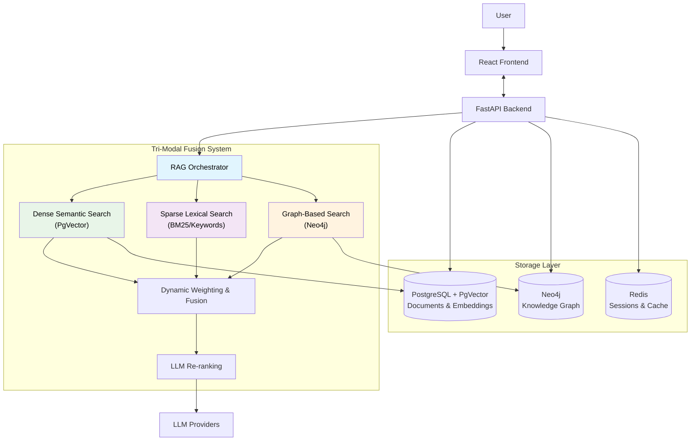
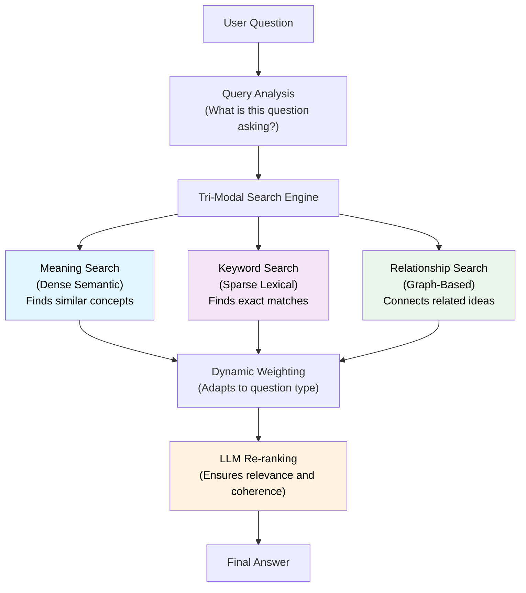
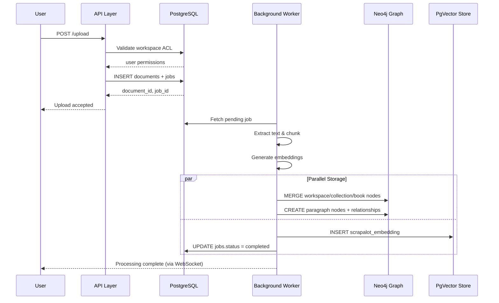

# scrapalot-chat

This is an advanced RAG (Retrieval Augmented Generation) chat application called "scrapalot-chat" that provides a sophisticated document-based AI assistant with multiple retrieval strategies, real-time features, and flexible model provider support. The system integrates a powerful knowledge graph architecture with tri-modal fusion retrieval to deliver comprehensive and contextually relevant answers.

[](https://discord.gg/mmuCqzFXs7)

> 💬 **Join the community** — questions, self-hosting help, and roadmap discussion live on our [Discord server](https://discord.gg/mmuCqzFXs7).

## 🚀 Key Features

### 🎯 Advanced RAG Orchestration
- **9 RAG Orchestrators**: Adaptive, Precision, Balanced, Low Latency, Context-Enhanced, Knowledge-Intensive, Document Hierarchy, Query Refinement, and Feedback Loop orchestrators
- **Multiple RAG Strategies**: HyDE, Multi-Query, Fusion, Self-Query, Hybrid Self-Query, Graph Search, Parent Document, Step-Back, Decomposition, and Generative Feedback Loop
- **Dynamic Strategy Selection**: Automatically selects optimal retrieval strategies based on query characteristics
- **Tri-Modal Fusion**: Combines dense semantic search, sparse lexical search, and graph-based search for comprehensive knowledge retrieval

### 🔧 Multi-Provider LLM Support
- **Local Models**: Support for GGUF models with GPU acceleration via llama-cpp-python
- **Universal GPU Support**: Vulkan backend for cross-platform GPU acceleration on NVIDIA, AMD, Intel, and Apple GPUs
- **Remote Providers**: OpenAI, Anthropic, Google Gemini, Ollama, vLLM, DeepSeek, and more
- **User-Specific Configurations**: Each user can configure their own model providers and API keys
- **Model Management**: Download, install, and manage local models from Hugging Face

### 📊 Real-Time Features
- **WebSocket Integration**: Real-time document processing progress updates
- **Live Model Downloads**: Progress tracking for model downloads with Server-Sent Events
- **Real-Time Chat**: Streaming responses with Socket.IO support
- **Job Tracking**: Live status updates for background processing tasks

### 📚 Advanced Document Processing
- **Multiple Formats**: PDF, DOCX, TXT with intelligent content extraction
- **GPU Acceleration**: Docling for advanced PDF processing when GPU is available
- **Intelligent Chunking**: Structure-aware and proposition-based chunking strategies
- **Entity Extraction**: Sophisticated entity and relationship extraction with deduplication
- **Knowledge Graph Construction**: Automatic creation of concept graphs from document content

### 🏗️ Architecture



**Backend (`scrapalot-chat/`):**
- FastAPI-based Python service with async support
- PostgreSQL with pgvector for embeddings storage
- Redis for chat history and session management
- Neo4j for knowledge graph and relationship-based retrieval
- SQLite fallback for development environments
- Alembic for database migrations

**Frontend (`scrapalot-chat-ui/`):**
- React-based web interface with TypeScript
- Real-time updates via WebSocket connections
- PDF viewing and document management
- Model provider configuration interface

## 🛠️ Technology Stack

### Backend Technologies
- **FastAPI**: Modern Python web framework with automatic API documentation
- **LangChain**: Framework for LLM application development with extensive integrations
- **PostgreSQL + pgvector**: Vector database for embeddings storage
- **Redis**: In-memory data store for sessions and caching
- **Neo4j**: Graph database for knowledge graph construction and traversal
- **Socket.IO**: Real-time WebSocket communication
- **Alembic**: Database migration management
- **Pydantic**: Data validation and serialization
- **SQLAlchemy**: ORM for database interactions

### AI/ML Technologies
- **llama-cpp-python**: Local GGUF model execution with GPU support
- **Sentence Transformers**: Text embeddings generation with optimized models
- **PyTorch**: Deep learning framework with CUDA support
- **Transformers**: Hugging Face transformers library
- **Docling**: Advanced PDF processing with layout understanding
- **LangChain Neo4j Integration**: Graph-based retrieval and Cypher query generation

### Frontend Technologies
- **React 18**: Modern React with hooks and concurrent features
- **TypeScript**: Type-safe JavaScript development
- **Tailwind CSS**: Utility-first CSS framework
- **Radix UI**: Accessible component primitives
- **Socket.IO Client**: Real-time communication
- **React Router**: Client-side routing

## 📋 Prerequisites

- **Python 3.10+**: Required for backend services
- **Node.js 18+**: Required for frontend development
- **Docker & Docker Compose**: For containerized deployment
- **PostgreSQL 14+**: With pgvector extension
- **Redis 6+**: For session management
- **8GB+ RAM**: Minimum for local model execution
- **CUDA-compatible GPU**: Optional for accelerated inference

## 🚀 Quick Start

### Option 1: Docker Compose (Recommended)

1. **Clone the repository:**
```bash
git clone <repository-url>
cd scrapalot-chat
```

2. **Configure environment:**
```bash
cp docker-scrapalot/example.env .env
# Edit .env with your configuration
```

3. **Start services:**
```bash
cd docker-scrapalot
docker-compose up -d
```

4. **Access the application:**
- Frontend: http://localhost:3000
- Backend API: http://localhost:8090
- API Documentation: http://localhost:8090/docs

### Option 2: Manual Installation

1. **Backend Setup:**
```bash
cd scrapalot-chat
python -m venv venv
source venv/bin/activate  # On Windows: venv\Scripts\activate
pip install -r requirements.txt
```

2. **Database Setup:**
```bash
# Start PostgreSQL and Redis
# Update configs/config.yaml with your database settings
python -m alembic upgrade head
```

3. **Frontend Setup:**
```bash
cd scrapalot-chat-ui
npm install
npm run dev
```

4. **Start Backend:**
```bash
cd scrapalot-chat
python run_service.py
```

## 🎯 RAG Orchestration Strategies

Scrapalot-Chat supports multiple RAG orchestration strategies that combine various techniques for optimal performance. At the core of our advanced retrieval system is the tri-modal fusion approach that integrates three complementary search modalities:



### Core Orchestrators

1. **Adaptive RAG Orchestrator** (`use_adaptive_orchestrator: true`)
   - Dynamically selects the best technique based on query characteristics
   - Analyzes queries to identify their type and complexity
   - Optimizes for both accuracy and performance
   - **Best for**: Production environments with diverse query patterns

2. **Precision RAG Orchestrator** (`use_precision_orchestrator: true`)
   - Combines multiple techniques for maximum accuracy
   - Uses HybridSelfQuery for metadata filtering and MultiQuery for generating variations
   - **Best for**: Complex queries requiring high accuracy where latency is less critical

3. **Balanced RAG Orchestrator** (`use_balanced_orchestrator: true`)
   - Good balance between accuracy and latency
   - Combines SelfQuery for metadata filtering and HyDE for semantic retrieval
   - **Best for**: General-purpose queries with balanced requirements

4. **Low Latency RAG Orchestrator** (`use_low_latency_orchestrator: true`)
   - Optimized for speed and efficiency
   - Uses query optimization techniques and lightweight metadata filtering
   - **Best for**: Time-sensitive applications requiring quick responses

5. **Context-Enhanced RAG Orchestrator** (`use_context_enhanced_orchestrator: true`)
   - Leverages conversation history to improve retrieval
   - Adjusts strategies based on conversational context
   - **Best for**: Conversational applications where context matters

### Specialized Orchestrators

6. **Knowledge-Intensive RAG Orchestrator** (`use_knowledge_intensive_orchestrator: true`)
   - Combines step-back reasoning and query decomposition
   - Tackles complex factual questions and multi-step reasoning
   - **Best for**: Complex "why" questions and reasoning tasks

7. **Document Hierarchy RAG Orchestrator** (`use_document_hierarchy_orchestrator: true`)
   - Leverages document structure and parent-child relationships
   - Uses query rewriting and parent document context
   - **Best for**: Queries requiring broader document context

8. **Query Refinement RAG Orchestrator** (`use_query_refinement_orchestrator: true`)
   - Focuses on query processing and result fusion
   - Combines query chain and fusion techniques
   - **Best for**: Ambiguous queries and exploratory search

9. **Feedback Loop RAG Orchestrator** (`use_feedback_loop_orchestrator: true`)
   - Uses iterative refinement through generative feedback
   - Enables self-correcting retrieval
   - **Best for**: Handling retrieval failures and edge cases

### Enabling RAG Orchestration

To enable a specific RAG orchestration strategy, edit your `configs/config.yaml` file:

```yaml
rag:
  # Only enable ONE orchestrator at a time
  use_adaptive_orchestrator: true     # Recommended for most use cases
  use_precision_orchestrator: false
  use_balanced_orchestrator: false
  use_low_latency_orchestrator: false
  use_context_enhanced_orchestrator: false
  use_knowledge_intensive_orchestrator: false
  use_document_hierarchy_orchestrator: false
  use_query_refinement_orchestrator: false
  use_feedback_loop_orchestrator: false

  # Common parameters
  max_results: 10
  chunk_size: 256
  chunk_overlap: 64
```

## 🤖 Model Provider Configuration

### Supported Providers

- **Local**: GGUF models with llama-cpp-python
- **Ollama**: Local Ollama server integration
- **vLLM**: High-performance inference server
- **OpenAI**: GPT models including o3-mini
- **Anthropic**: Claude models
- **Google**: Gemini models
- **DeepSeek**: Advanced reasoning models

### User-Specific Configuration

Each user can configure their own model providers through the settings interface:

1. Navigate to Settings → Providers
2. Add your API keys and endpoints
3. Select models for chat and reasoning tasks
4. Configure provider-specific settings

### Local Model Management

The application includes comprehensive local model management:

- **Model Discovery**: Automatic detection of installed GGUF models
- **Hugging Face Integration**: Browse and download models directly
- **Hardware Optimization**: GPU/CPU detection and optimization
- **Progress Tracking**: Real-time download progress with WebSocket updates

## 📊 Real-Time Progress Tracking

### WebSocket Architecture

The application uses a sophisticated WebSocket system for real-time updates:

#### Frontend Implementation
- **React State Management**: Tracks upload progress for each file
- **DocumentProcessingTracker**: Manages WebSocket connections per job
- **Automatic Cleanup**: Proper cleanup when processing completes

#### Backend Implementation
- **WebSocketManager**: Singleton pattern for connection management
- **Job Tracking**: Maps job IDs to connected clients
- **Progress Throttling**: Prevents overwhelming clients with updates
- **Multiple Transports**: Socket.IO with polling fallback

#### Progress Stages
1. **Upload** (0-10%): File upload to server
2. **Metadata Extraction** (10-20%): Document analysis
3. **Content Processing** (20-50%): Text extraction and chunking
4. **Embedding Generation** (60-95%): Vector embeddings creation
5. **Database Updates** (95-100%): Metadata and index updates

## 🗄️ Database Architecture

### Two-Database Architecture



### PostgreSQL with pgvector
- **Documents**: Document metadata and content
- **Collections**: Document organization
- **Workspaces**: User workspace management
- **Embeddings**: Vector storage with pgvector using MiniLM-v6 model
- **Model Providers**: User-specific provider configurations
- **User Settings**: Personalized application settings

### Neo4j Knowledge Graph
- **Document Structure**: Workspace, Collection, Book, and Paragraph nodes
- **Entities & Concepts**: Extracted entities with relationships
- **Relationship Types**: CONTAINS, REFERENCES, SIMILAR_TO, and domain-specific relations
- **Entity Deduplication**: Intelligent entity matching and merging

### Redis Integration
- **Chat History**: Conversation persistence
- **Session Management**: User session tracking
- **Job Status**: Background task coordination
- **Caching**: Temporary data storage

### SQLite Fallback
- Automatic fallback for development environments
- No pgvector support (uses fallback retriever)
- Simplified setup for testing

## 🛡️ Security Features

- **JWT Authentication**: Secure user authentication
- **API Key Management**: Encrypted storage of provider API keys
- **CORS Configuration**: Proper cross-origin request handling
- **Input Validation**: Pydantic-based request validation
- **SQL Injection Protection**: SQLAlchemy ORM with parameterized queries

## 📈 Performance Optimization

### GPU Acceleration
- **CUDA Support**: GPU acceleration for local models
- **Memory Management**: Efficient GPU memory utilization
- **Batch Processing**: Optimized batch sizes for embeddings
- **Model Quantization**: Support for various quantization levels

### Caching Strategy
- **LLM Instance Caching**: Reuse loaded models across requests
- **Embedding Caching**: Cache frequently used embeddings
- **Redis Caching**: Session and temporary data caching
- **Database Optimization**: Efficient queries with proper indexing

## 📋 Database Migrations

The application uses Alembic for database schema management:

### Automatic Migration (Recommended)
```bash
# Start PostgreSQL container
docker-compose up -d postgres

# Apply migrations
docker-compose exec scrapalot python -m alembic upgrade head
```

### Manual Migration
```bash
# Connect to your PostgreSQL database
psql -h localhost -p 15432 -U scrapalot -d scrapalot -f migrations.sql
```

### New Database Tables

The migration adds support for:
1. **model_providers**: User-configured LLM providers
2. **model_provider_models**: Models available for each provider
3. **user_settings**: User-specific application settings

## 🖥️ GPU Acceleration Setup

### Prerequisites
- **NVIDIA GPU**: RTX series recommended (tested on RTX PRO 4500 Blackwell)
- **Latest NVIDIA drivers**: Ensure CUDA 12.1+ compatibility
- **Conda environment**: Python 3.10+ (scrapalot-chat environment)

### Quick GPU Setup

For CUDA acceleration, use the dedicated GPU requirements file:

```powershell
# Activate your conda environment
conda activate scrapalot-chat

# Remove conflicting packages (if present)
conda run -n scrapalot-chat pip uninstall surya-ocr -y

# Install GPU-optimized packages
conda run -n scrapalot-chat pip install -r requirements-gpu.txt
```

### Verify GPU Installation

```powershell
# Test PyTorch CUDA support
conda run -n scrapalot-chat python -c "import torch; print('CUDA available:', torch.cuda.is_available()); print('GPU count:', torch.cuda.device_count()); print('GPU name:', torch.cuda.get_device_name(0) if torch.cuda.is_available() else 'N/A')"

# Test llama-cpp-python CUDA support
conda run -n scrapalot-chat python -c "from llama_cpp import Llama; print('llama-cpp-python with CUDA support ready')"
```

### What's Included in requirements-gpu.txt

- **PyTorch with CUDA 12.1**: `torch==2.5.1+cu121`, `torchvision==0.20.1+cu121`, `torchaudio==2.5.1+cu121`
- **llama-cpp-python with cuBLAS**: Pre-compiled wheel with CUDA acceleration
- **Alternative options**: Commented instructions for CUDA 11.8 and Vulkan support

### Performance Optimization

Configure model settings in `config.yaml`:
```yaml
llm:
  advanced:
    gpu_layers: 50  # Adjust based on GPU VRAM (0 = CPU only)
    context_size: 8192
    batch_size: 512
```

### Troubleshooting

- **Dependency conflicts**: The setup automatically handles surya-ocr conflicts
- **CUDA version mismatch**: Ensure your NVIDIA drivers support CUDA 12.1+
- **Memory issues**: Reduce `gpu_layers` if you encounter VRAM limitations

For detailed GPU setup instructions, see [docs/README_GPU_SETUP.md](docs/README_GPU_SETUP.md).

## 🔧 Configuration

### Main Configuration (`configs/config.yaml`)

Key configuration sections:
- **Server Settings**: Host, port, workers
- **Database**: PostgreSQL, Redis, Neo4j
- **LLM Models**: Provider configurations
- **RAG Settings**: Chunking, retrieval parameters
- **Document Processing**: Upload limits, batch sizes

### Environment Variables

Configure via `.env` file or environment:
```bash
# Database
POSTGRES_HOST=localhost
POSTGRES_PORT=15432
REDIS_HOST=localhost

# Model Configuration
LLM_PROVIDER=local
LLM_GPU_LAYERS=0
```

## 📚 API Documentation

The application provides comprehensive API documentation:

- **Interactive Docs**: Available at `/docs` when running
- **OpenAPI Spec**: Generated automatically by FastAPI
- **WebSocket Events**: Documented in the WebSocket manager

### Key Endpoints

- **Chat**: `/chat/conversations` - Chat interactions
- **Documents**: `/documents` - Document management
- **Settings**: `/settings` - User configuration
- **LLM Inference**: `/llm-inference` - Model management
- **WebSocket**: `/ws` - Real-time communication

## 🧪 Testing

### Running Tests
```bash
# Backend tests
cd scrapalot-chat
python -m pytest tests/

# Frontend tests
cd scrapalot-chat-ui
npm test
```

### Test Coverage
- Unit tests for core RAG strategies
- Integration tests for database operations
- WebSocket connection testing
- Model provider validation

## 🚀 Deployment

### Production Deployment

1. **Configure Environment:**
```bash
# Use production configurations
export ENVIRONMENT=prod
export DEBUG=false
```

2. **Database Setup:**
```bash
# Run migrations
python -m alembic upgrade head
```

3. **Start Services:**
   ```bash
# Using Docker Compose
docker-compose -f docker-compose.prod.yml up -d

# Or manually
```bash
uvicorn src.main.app_instance:app --host 0.0.0.0 --port 8090 --workers 4
```

### Hosting Options

See [HOSTING.md](HOSTING.md) for detailed hosting instructions including:
- VPS deployment with Nginx Proxy Manager
- SSL certificate setup with Cloudflare
- Domain configuration
- Hostinger VPS template usage

## 🔍 Monitoring and Logging

### Logging Configuration
- **Structured Logging**: JSON-formatted logs for production
- **Log Levels**: Configurable via `configs/logging.conf`
- **Performance Metrics**: Request timing and resource usage
- **Error Tracking**: Comprehensive error reporting

### Health Checks
- **Database Connectivity**: PostgreSQL and Redis health checks
- **Model Availability**: Local and remote model status
- **WebSocket Status**: Real-time connection monitoring

## 🤝 Contributing

1. **Fork the repository**
2. **Create a feature branch**: `git checkout -b feature/amazing-feature`
3. **Commit changes**: `git commit -m 'Add amazing feature'`
4. **Push to branch**: `git push origin feature/amazing-feature`
5. **Open a Pull Request**

### Development Guidelines
- Follow PEP 8 for Python code
- Use TypeScript for frontend development
- Write tests for new features
- Update documentation for API changes

## 📖 Additional Documentation

For more detailed information, see the documentation in the `docs/` folder:

- [README_GPU_SETUP.md](docs/README_GPU_SETUP.md) - Comprehensive GPU acceleration setup guide
- [README_RAG_ARCHITECTURE.md](docs/README_RAG_ARCHITECTURE.md) - Detailed RAG strategy explanations
- [README_MODEL_MANAGEMENT.md](docs/README_MODEL_MANAGEMENT.md) - Local model setup and management
- [README_WEBSOCKET_ARCHITECTURE.md](docs/README_WEBSOCKET_ARCHITECTURE.md) - Real-time communication details
- [README_DATABASE_DESIGN.md](docs/README_DATABASE_DESIGN.md) - Database schema and design patterns
- [README_DEPLOYMENT_GUIDE.md](docs/README_DEPLOYMENT_GUIDE.md) - Production deployment guide

### Knowledge Graph RAG Documentation

Explore our comprehensive Graph RAG implementation in the `docs/grag/` directory:

- [00-plan-prd.md](docs/grag/00-plan-prd.md) - Master project plan with implementation phases
- [01-graph-schema.md](docs/grag/01-graph-schema.md) - Neo4j schema definition
- [02-relational-graph-boundary.md](docs/grag/02-relational-graph-boundary.md) - PostgreSQL ↔ Neo4j data boundary
- [03-ingestion-indexing.md](docs/grag/03-ingestion-indexing.md) - Document processing pipeline
- [04-tri-modal-fusion.md](docs/grag/04-tri-modal-fusion.md) - Tri-modal retrieval architecture

## 📄 License

Scrapalot is **open-core**. This repository is part of the **proprietary, hosted Scrapalot product** (Pro / Team / Enterprise) — © 2024–2026 Scrapalot, all rights reserved.

A free, self-hostable **Community Edition** is published separately under the **AGPL-3.0** license. See [Editions](https://docs.scrapalot.app/getting-started/editions) for what each includes.

## 🙏 Acknowledgments

- **LangChain**: For the comprehensive LLM framework
- **Hugging Face**: For model hosting and transformers library
- **FastAPI**: For the high-performance web framework
- **PostgreSQL & pgvector**: For vector database capabilities
- **React Community**: For the modern frontend framework

## 📞 Support

For support and questions:
- **Issues**: Create an issue on GitHub
- **Documentation**: Check the docs folder
- **Community**: Join our discussions

---

**Made with ❤️ for the AI community**# Test trigger Sat Dec  6 02:30:39 PM UTC 2025
