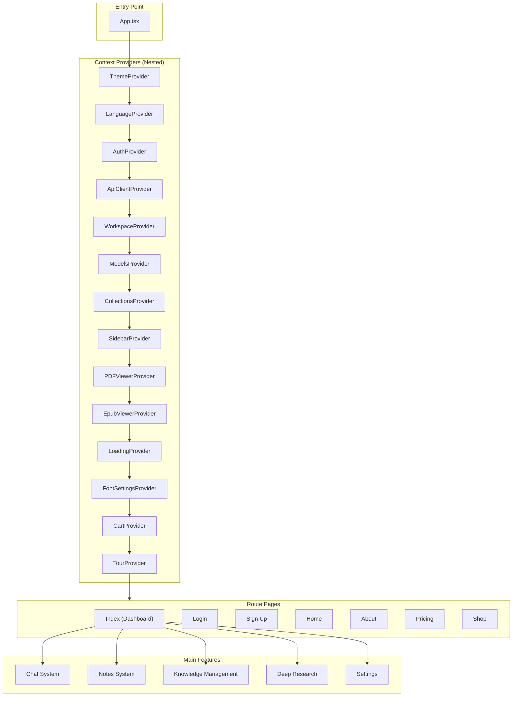
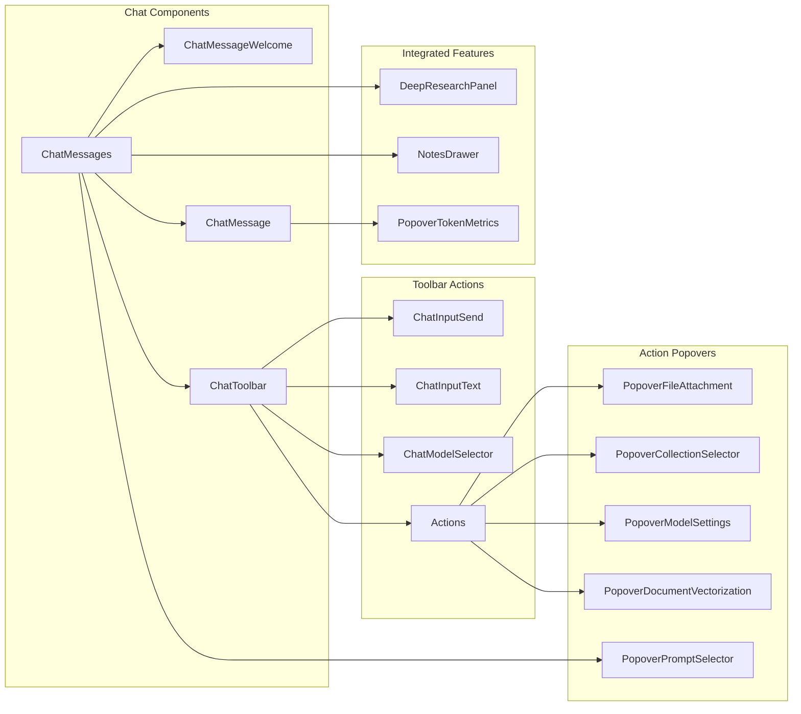
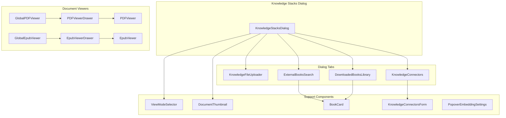
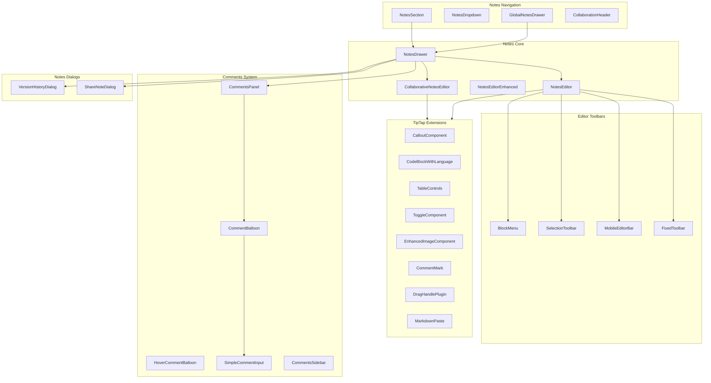
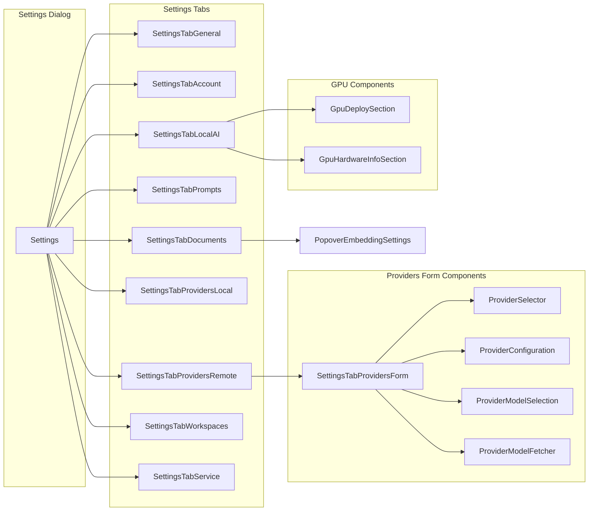
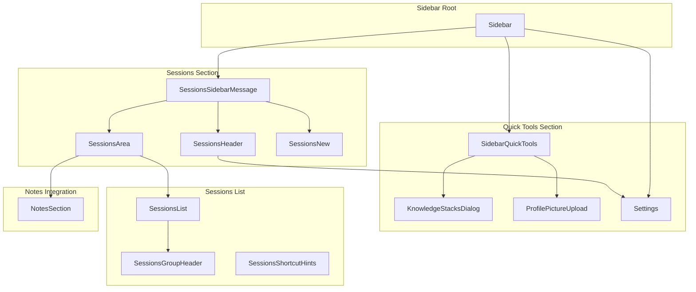

# Component Architecture

**Last Updated**: March 2026

This document visualizes the component relationships and architecture of the Scrapalot UI codebase.

## Component Hierarchy Mindmap

```mermaid
mindmap
  root((Scrapalot UI))
    App.tsx
      Providers
        ThemeProvider
        LanguageProvider
        AuthProvider
        ApiClientProvider
        WorkspaceProvider
        ModelsProvider
        CollectionsProvider
        SidebarProvider
        PDFViewerProvider
        EpubViewerProvider
        LoadingProvider
        FontSettingsProvider
        CartProvider
        TourProvider
        DocxViewerProvider
        MarkdownViewerProvider
      Router
        Pages
        ProtectedRoute
    Pages
      Index
        ChatMessages
        Sidebar
        GlobalSidebarToggle
        LicenseAgreementModal
        ChatMessageWelcome
      Login
        SharedHeader
        StarsAnimation
      SignUp
        SharedHeader
      Home
        SharedHeader
        StarsAnimation
      About
        SharedHeader
        AnimatedDemoSection
      Pricing
        SharedHeader
        AnimatedPricingCard
        AnimatedFAQ
      Shop
        SharedHeader
        CartPanel
      BuyLicense
        SharedHeader
      Desktop
        SharedHeader
    Layout
      Sidebar
        SidebarQuickTools
          KnowledgeStacksDialog
          ProfilePictureUpload
          Settings
        SessionsSidebarMessage
          SessionsHeader
          SessionsArea
          SessionsNew
        Settings
      SharedHeader
        CartPanel
        LoginPopover
        ThemeToggle
      GlobalSidebarToggle
    Chat
      ChatMessages
        ChatMessage
        ChatToolbar
        NotesDrawer
        DeepResearchPanel
        PopoverPromptSelector
      ChatMessage
        PopoverTokenMetrics
      ChatToolbar
        Actions
        ChatInputSend
        ChatInputText
        ChatModelSelector
      Actions
        PopoverFileAttachment
        PopoverCollectionSelector
        PopoverModelSettings
        PopoverDocumentVectorization
      ChatMessageWelcome
    Research
      DeepResearchPanel
      InlineResearchProgress
    Notes
      NotesDrawer
        NotesEditor
        CollaborativeNotesEditor
      NotesEditor
        FixedToolbar
        MobileEditorBar
        SelectionToolbar
        BlockMenu
      NotesSection
      NotesDropdown
      GlobalNotesDrawer
      CommentsPanel
      CommentBalloon
      ShareNoteDialog
      VersionHistoryDialog
      Extensions
        CalloutComponent
        CodeBlockWithLanguage
        TableControls
        ToggleComponent
        EnhancedImageComponent
        MarkdownPaste
    Knowledge
      KnowledgeStacksDialog
        KnowledgeFileUploader
        KnowledgeConnectors
        ExternalBooksSearch
        DownloadedBooksLibrary
        ViewModeSelector
        DocumentThumbnail
      KnowledgeFileUploader
      KnowledgeConnectors
        KnowledgeConnectorsForm
      PDFViewerDrawer
        PDFViewer
      EpubViewerDrawer
        EpubViewer
      BookCard
      PopoverEmbeddingSettings
    Settings
      Settings Dialog
        SettingsTabGeneral
        SettingsTabAccount
        SettingsTabDocuments
        SettingsTabPrompts
        SettingsTabProvidersRemote
        SettingsTabProvidersLocal
        SettingsTabLocalAI
        SettingsTabWorkspaces
        SettingsTabService
      SettingsTabProvidersForm
        ProviderSelector
        ProviderConfiguration
        ProviderModelSelection
        ProviderModelFetcher
      GpuDeploySection
      GpuHardwareInfoSection
    Workspace
      TeamManagementDialog
      PopoverAddWorkspace
      PopoverAddTeammate
    Cart
      CartPanel
    Auth
      LicenseAgreementModal
      LoginPopover
      ProtectedRoute
    UI Primitives
      Button
      Dialog
      Sheet
      Drawer
      Popover
      DropdownMenu
      Select
      Input
      Textarea
      Checkbox
      Switch
      Slider
      Badge
      Avatar
      Card
      Tabs
      Accordion
      Collapsible
      ScrollArea
      Tooltip
      Label
      Separator
      Progress
      RadioGroup
      AlertDialog
      ContextMenu
      Command
      NavigationMenu
      Menubar
      Form
      Calendar
      Carousel
      Pagination
      Resizable
      ToggleGroup
      Skeleton
      Diode
      OfflineModeBanner
      ProcessingOverlay
      GlobalLoadingSpinner
      PerformanceMonitorWidget
```

## Data Flow Architecture

## Chat System Components

## Knowledge Management System

## Notes System Architecture

## Settings System

## Hooks & Contexts Dependencies

```mermaid
flowchart TB
    subgraph Contexts["React Contexts"]
        AuthCtx["AuthContext"]
        WSCtx["WorkspaceContext"]
        ModelsCtx["ModelsContext"]
        CollCtx["CollectionsContext"]
        SidebarCtx["SidebarContext"]
        PDFCtx["PDFViewerContext"]
        EPUBCtx["EpubViewerContext"]
        LoadingCtx["LoadingContext"]
        FontCtx["FontSettingsContext"]
        CartCtx["CartContext"]
        TourCtx["TourContext"]
        APICtx["ApiClientContext"]
        DRCtx["DeepResearchContext"]
    end

    subgraph Hooks["Custom Hooks"]
        useAuth["useAuth"]
        useWS["useWorkspace"]
        useModels["useModels"]
        useColl["useCollections"]
        useSidebar["useSidebar"]
        usePDF["usePdfDrawer"]
        useEPUB["useEpubViewer"]
        useMobile["useIsMobile"]
        useProviders["useProviders"]
        useConv["useConversations"]
        useNotes["useNotesDrawer"]
        useDR["useDeepResearchPanel"]
        useAdmin["useAdminCheck"]
        useDesktop["useDesktopMode"]
        useTheme["useTheme"]
        useLang["useLanguage"]
    end

    subgraph Providers["Provider Components"]
        ThemeProv["ThemeProvider"]
        LangProv["LanguageProvider"]
    end

    AuthCtx --> useAuth
    WSCtx --> useWS
    ModelsCtx --> useModels
    CollCtx --> useColl
    SidebarCtx --> useSidebar
    PDFCtx --> usePDF
    EPUBCtx --> useEPUB
    DRCtx --> useDR
    CartCtx --> useCart["useCart"]

    ThemeProv --> useTheme
    LangProv --> useLang

    useAuth --> useConv
    useAuth --> APICtx
    useWS --> useColl
    useProviders --> useModels
```

## Sidebar Component Tree

## UI Primitives Usage

The following Radix UI-based primitives are used throughout the application:

| Primitive | Primary Consumers |
|-----------|-------------------|
| `Button` | All components (50+ usages) |
| `Dialog` | Settings, Notes, Chat, Knowledge |
| `Sheet` | Cart, Providers Form, Connectors |
| `Drawer` | PDF Viewer, EPUB Viewer, Notes |
| `Popover` | Toolbar actions, Embedding settings |
| `DropdownMenu` | Settings, Sessions, Knowledge |
| `Select` | Model selector, Settings, Prompts |
| `Input` | Forms, Search, Settings |
| `Textarea` | Chat input, Notes comments |
| `Checkbox` | Collection selector, Settings |
| `Switch` | Settings toggles |
| `Slider` | Model settings, Profile picture |
| `Badge` | Status indicators, Tags |
| `Avatar` | User profiles, Comments |
| `Card` | Pricing, Shop, Stats |
| `Tabs` | Settings, Knowledge dialog |
| `Accordion` | Model settings, Vectorization |
| `Collapsible` | Sessions, Local AI |
| `ScrollArea` | Lists, Panels |
| `Tooltip` | Help text, Actions |
| `Progress` | Upload, Download |
| `AlertDialog` | Confirmations |

## Personalization & UX

A bundle of cross-cutting features that change how the chat surface is presented to the user. Each one is small in code but touches many components, so the entry points are documented together.

### Simple Mode

`useSimpleMode()` (`src/hooks/use-simple-mode.ts`) is a synchronous boolean hook backed by `localStorage['scrapalot_simple_mode_enabled']` and a `scrapalot:simple-mode-changed` `CustomEvent`. The settings panel toggles it via `setSimpleModeEnabled(value)`; consumers read with `const simpleMode = useSimpleMode();` and gate with `{!simpleMode && <X />}`. Surfaces gated today:

- Model selector chip (desktop + mobile) in `chat-toolbar.tsx`.
- Strategy and Parameters tabs/sections in `popover-collection-selector.tsx` (Collections tab stays, becomes full-width). The active tab is clamped to `'collections'` while simple mode is on.
- Explicit RAG-trace open button on assistant messages in `chat-message.tsx` — the basic `PopoverTokenMetrics` fallback always renders so token info is still available.

What stays visible: chat input + send, collection picker, web search / Bridge / agentic toggles, citations, the Settings cog. A small `data-testid="chat-toolbar-show-advanced"` link beneath the toolbar flips simple mode off in one click — so users never get stranded behind the gate.

### Command Palette (Cmd+K / Ctrl+K)

`src/components/command-palette/command-palette.tsx` is mounted at app shell level. Built on the `cmdk` primitive that the slash-command popover already uses. Groups: Navigation, Actions, Recent documents (top 8 from `getRecentDocuments`), Help. Recent doc names are hydrated with `getDocumentById` lookups; the 60 s response cache in `api.ts` makes repeat opens free. Selecting a recent doc dispatches `scrapalot:open-document` so the PDF/EPUB viewer opens regardless of which surface initiated the open.

### Recent Documents (sidebar + palette)

`scrapalot:recent-documents-changed` is a global `CustomEvent` fired from `recordDocumentView()` after a successful POST to `/document-views`. Two listeners react to it:

- `src/components/layout/sidebar/sessions-list/sidebar-recent-documents.tsx` — collapsible "Recent" group in the sessions sidebar (history icon + count badge + chevron). Mounted inside `SessionsArea` between the "New Conversation" button and the Unfiled sessions group. Persists expand/collapse state in `localStorage['scrapalot_sidebar_recent_expanded']`. Click on a row dispatches `scrapalot:open-document` (same wiring as the palette).
- The Command Palette's `Recent` group (refetches on every open).

Both render the same source-icon set (`pdf_open`, `epub_open`, `cited`, `rag_retrieved`, `note_linked`) and use `date-fns` `formatDistanceToNow` with an `hr` / `mk` locale when the UI language matches.

### Deep Research Activity Timeline

`src/components/research/deep-research-activity-timeline.tsx` (~318 LOC) replaces the older "current status row" inside `deep-research-panel.tsx`. Vertical scrollable timeline, virtualized at >150 rows, with 6 filter buckets (planning, retrieval, web, verification, synthesis, misc). Each row maps a streaming packet type to an icon + headline; expanding a row shows the packet payload. The backend already emitted everything before this rewrite — this is pure UI.

### Document Quality Rating

`src/components/document-rating/star-rating.tsx` is a 5-star widget with optimistic local update. Used in the library card and the PDF viewer header. Backend: `user_document_ratings` table (Liquibase changeset 107) and `UserDocumentRatingController.kt`. The retrieval-side boost is gated by a feature flag; until enabled, ratings only sort the library view.

### Knowledge Stack Custom Instructions (per-collection)

`src/components/knowledge/knowledge-stacks-dialog.tsx` exposes a "Custom AI Instructions" textarea (max 2000 chars, with a ✨ button that asks the LLM for a baseline tailored to the collection). The value is sent on `PATCH /collections/{id}` as `custom_instructions` and consumed by Layer 3 of the Python system-prompt builder.

### Agent Profiles picker

`src/components/settings/settings-tab-general.tsx` carries the active-profile dropdown ("Profile: Academic ▾"). Four seeded system profiles ship with the migration (Legal, Medical, Academic, Technical); workspace admins can create more via `AgentProfileController.kt`. The chosen profile drives Layer 2 of the system-prompt builder and the orchestrator's RAG strategy / model preference.

### Response Personalization

Three settings live in `user_settings` (KV) and feed Layer 4 of the system-prompt builder: `chat.response_length`, `chat.response_formality`, `chat.response_domain_focus`. The general settings tab exposes them as a length slider, formality slider, and a free-text "domain focus" textarea (≤ 100 chars).

## Component Statistics

| Category | Count | Notes |
|----------|-------|-------|
| **Total TSX Components** | 289 | All React components across the codebase |
| UI Primitives (src/components/ui) | 64 | Radix UI-based primitives (buttons, dialogs, etc.) |
| Notes Components | 30 | TipTap editor, toolbars, collaboration |
| Settings Components | 25 | Settings tabs, provider configuration |
| Knowledge Components | 22 | Document management, library, viewers |
| Chat Components | 18 | Chat interface, toolbar, messages |
| Layout Components | 10 | Sidebar, header, navigation |
| Research Components | 2 | Deep research panel, inline progress |
| **Custom Hooks** | 28 | 5,702 total lines |
| **Context Providers** | 15 | 4,333 total lines |
| **Pages** | 10 | Login, home, about, pricing, desktop, etc. |
| **API Modules** | 20 | 220KB total size across all modules |

### Context Providers (15)

| Provider | Lines | Purpose |
|----------|-------|---------|
| `AuthContext` | 1,274 | Authentication state, user session, token management |
| `WorkspaceContext` | 341 | Workspace selection, team management |
| `ModelsContext` | 100 | LLM model configuration |
| `CollectionsContext` | 243 | Document collections with pagination |
| `DeepResearchContext` | 1,170 | Research state, packets, progress (49 packet types) |
| `SidebarContext` | 167 | Sidebar visibility, state, width management |
| `ApiClientContext` | 77 | Axios client, auth state synchronization |
| `LoadingContext` | 110 | Global loading states, document processing progress |
| `PDFViewerContext` | 130 | PDF viewer state, position tracking |
| `EpubViewerContext` | 109 | EPUB reader state, location tracking |
| `DocxViewerContext` | 101 | DOCX viewer state |
| `MarkdownViewerContext` | — | Markdown viewer state |
| `CartContext` | 96 | Shopping cart (licensing), checkout flow |
| `FontSettingsContext` | 66 | Typography preferences, code theme |
| `TourContext` | 349 | Onboarding tour state, 5-step tutorial |

**Total**: 4,333+ lines across 15 context providers

### Custom Hooks (28)

| Hook | Purpose | Key Features |
|------|---------|--------------|
| `useAuth` | Authentication operations | Login, logout, token refresh, offline mode |
| `useWorkspace` | Workspace operations | Lazy loading, workspace switching |
| `useModels` | Model management | Provider integration, model fetching |
| `useCollections` | Collection CRUD | Pagination, optimistic updates |
| `useSidebar` | Sidebar toggle | Auto-collapse on mobile |
| `usePdfDrawer` | PDF viewer control | Position tracking, reading progress |
| `useEpubViewer` | EPUB reader control | Location tracking, chapter navigation |
| `useIsMobile` | Responsive breakpoint | Dynamic viewport detection |
| `useProviders` | LLM provider config | Model fetching, provider management |
| `useConversations` | Chat session management | Session CRUD, message caching |
| `useNotesDrawer` | Notes panel control | Auto-save, collaboration |
| `useDeepResearchPanel` | Research orchestration (1,237 lines) | 49 packet types, 5-phase system |
| `useAdminCheck` | Admin role verification | Role-based access control |
| `useDesktopMode` | Desktop app detection | Electron/Tauri integration |
| `useTheme` | Theme switching | Light/dark mode, 6 accent colors |
| `useLanguage` | i18n language selection | English, Croatian |

**Total**: 5,702 lines across 16 custom hooks

---

*Generated from codebase analysis - March 2026*
