# E2E Testing Guide

**Last Updated**: March 2026

End-to-end testing documentation for the Scrapalot UI using Playwright.

## Overview

| Item | Value |
|------|-------|
| Framework | Playwright |
| Test Dir | `tests/e2e/` |
| Config | `playwright.config.ts` |
| Runner | Host machine (NOT Docker container) |
| Workers | 1 (sequential, VPS stability) |
| Browser | Chromium only |
| Default Timeout | 60s per test, 10s for assertions |
| Total Test Files | 48 spec files across 10 areas (47 in `tests/e2e/` + 1 standalone) |

## Test Suite Architecture

```mermaid
graph LR
    subgraph ADMIN["Admin (3)"]
        AD1["split-screen, graph, inspector"]
    end
    subgraph AUTH["Auth (1)"]
        A1["auth-flow"]
    end
    subgraph SETTINGS["Settings (3)"]
        S1["dialog, providers, form"]
    end
    subgraph WORKSPACE["Workspace (1)"]
        W1["workspace-mgmt"]
    end
    subgraph CHAT["Chat (12)"]
        C1["rag, agentic, graph, sessions, tutor"]
    end
    subgraph KNOWLEDGE["Knowledge (11)"]
        K1["upload, viewers, connectors, zotero"]
    end
    subgraph NOTES["Notes (4)"]
        N1["drawer, collab, citation, bib"]
    end
    subgraph PERSONALIZATION["Personalization (7)"]
        P1["agent profiles, command palette, custom instructions, ratings"]
    end
    subgraph REGRESSION["Regression (1)"]
        RG1["smoke"]
    end
    subgraph RESEARCH["Research (4)"]
        R1["v1, full, v2, activity timeline"]
    end

    ADMIN --> AUTH --> SETTINGS --> WORKSPACE --> CHAT --> KNOWLEDGE --> NOTES --> PERSONALIZATION --> REGRESSION --> RESEARCH

    style ADMIN fill:#22c55e,color:#fff
    style AUTH fill:#22c55e,color:#fff
    style SETTINGS fill:#22c55e,color:#fff
    style WORKSPACE fill:#22c55e,color:#fff
    style CHAT fill:#22c55e,color:#fff
    style KNOWLEDGE fill:#22c55e,color:#fff
    style NOTES fill:#22c55e,color:#fff
    style PERSONALIZATION fill:#22c55e,color:#fff
    style REGRESSION fill:#22c55e,color:#fff
    style RESEARCH fill:#22c55e,color:#fff
```



```
tests/e2e/
├── admin/                              # 3 spec files
│   ├── admin-split-screen.spec.ts      # Admin split-screen layout
│   ├── cross-book-graph.spec.ts        # Cross-book graph analysis
│   └── document-inspector.spec.ts      # RAG tracing dashboard
├── auth/                               # 1 spec file
│   └── auth-flow.spec.ts              # Login, logout
├── settings/                           # 3 spec files
│   ├── settings-dialog.spec.ts         # Settings dialog general
│   ├── settings-providers.spec.ts      # Provider management
│   └── settings-providers-form.spec.ts # Provider form validation
├── workspace/                          # 1 spec file
│   └── workspace-management.spec.ts    # Display, create, delete workspaces
├── chat/                               # 12 spec files
│   ├── agentic-rag.spec.ts             # Agentic RAG routing
│   ├── citation-mobile.spec.ts         # Citation on mobile
│   ├── delete-empty-session.spec.ts    # Empty session deletion
│   ├── graph-rag.spec.ts              # Graph RAG integration
│   ├── graph-rag-quality.spec.ts      # Graph RAG quality metrics
│   ├── message-toolbar.spec.ts        # Message toolbar actions
│   ├── rag-chat.spec.ts              # Basic RAG chat
│   ├── rag-quality.spec.ts           # RAG quality assertions
│   ├── session-loading.spec.ts        # Session switching stability
│   ├── sidebar-reorder.spec.ts        # Sidebar drag-reorder
│   ├── tiered-routing.spec.ts         # Tiered strategy routing
│   └── tutor-mode.spec.ts             # Tutor-mode flow
├── knowledge/                          # 11 spec files
│   ├── annotation-full-flow.spec.ts   # Annotation create/use/verify
│   ├── connectors-and-rag.spec.ts     # Connector → RAG integration
│   ├── document-upload.spec.ts        # Document upload flow
│   ├── document-viewer.spec.ts        # PDF/EPUB/DOCX viewers
│   ├── external-books.spec.ts         # External book search
│   ├── knowledge-management.spec.ts   # Collection CRUD
│   ├── nested-collections.spec.ts     # Nested collection hierarchy
│   ├── prd-features.spec.ts           # PRD feature tests
│   ├── saved-searches.spec.ts         # Saved search management
│   ├── thumbnail-quality.spec.ts      # Document thumbnail quality
│   └── zotero-features.spec.ts        # Zotero integration
├── notes/                              # 4 spec files
│   ├── bibliography-export.spec.ts    # Bibliography export
│   ├── citation.spec.ts              # Citation management
│   ├── notes-collaboration.spec.ts    # WebSocket connection, two-user sync
│   └── notes-drawer.spec.ts          # Open/close, content editing
├── personalization/                    # 7 spec files
│   ├── agent-profiles.spec.ts         # Agent profile CRUD
│   ├── command-palette.spec.ts        # Command palette shortcuts
│   ├── custom-instructions.spec.ts    # Per-collection instructions
│   ├── document-rating.spec.ts        # Document rating flow
│   ├── recent-documents.spec.ts       # Recent documents list
│   ├── response-personalization.spec.ts # Personalized response settings
│   └── simple-mode.spec.ts            # Simple mode toggle
├── regression/                         # 1 spec file
│   └── smoke.spec.ts                 # Smoke regression tests
└── research/                           # 4 spec files
    ├── deep-research.spec.ts                  # Basic research flow
    ├── deep-research-activity-timeline.spec.ts # Activity timeline rendering
    ├── deep-research-full.spec.ts             # 5-phase research, progress indicators
    └── deep-research-v2.spec.ts               # Deep research v2 features
```

Additionally, `tests/unified-document-upload-e2e.spec.ts` lives at the `tests/` root (outside `e2e/`) — full upload pipeline regression.

### Test Suite (48 spec files, 10 areas)

| Area | Spec Files | Timeout |
|------|------------|---------|
| Admin | 3 | 60s |
| Auth | 1 | 60s |
| Settings | 3 | 60s |
| Workspace | 1 | 60s |
| Chat | 12 | 120-180s |
| Knowledge | 11 | 60-120s |
| Notes | 4 | 120-180s |
| Personalization | 7 | 60-120s |
| Regression | 1 | 60s |
| Research | 4 | 120-300s |
| Standalone (`tests/unified-document-upload-e2e.spec.ts`) | 1 | 120s |

## Running Tests

```bash
# IMPORTANT: Tests run on HOST, not inside Docker container
# The scrapalot-ui container only has dist/ (production build), no test files

# Run all E2E tests
npx playwright test

# Run specific test file
npx playwright test tests/e2e/chat/rag-chat.spec.ts

# Run with visible browser (local development only)
npx playwright test --headed

# Run specific test by name
npx playwright test -g "should send RAG query"

# View HTML report
npx playwright show-report
```

### Production (Hetzner VPS)

```bash
# Tests run from /opt/scrapalot/scrapalot-ui/ on the host
cd /opt/scrapalot/scrapalot-ui
npx playwright test

# Results saved to:
# - playwright-report/    (HTML report)
# - test-results.json     (JSON report)
# - test-results/         (screenshots)
# - screenshots/          (debug screenshots)
```

## Test Execution Order

**CRITICAL**: On VPS (4 vCPU, 16GB RAM), test execution order matters due to server load.

**Configured order** (in `playwright.config.ts` testMatch):
1. `auth/auth-flow.spec.ts` - Login, logout (~10s)
2. `settings/settings-dialog.spec.ts` - UI settings (~20s)
3. `settings/settings-providers.spec.ts` - Providers, model selector (~15s)
4. `workspace/workspace-management.spec.ts` - CRUD workspaces (~25s)
5. `chat/rag-chat.spec.ts` - RAG chat, basic chat, message persistence (~45s)
6. `chat/rag-quality.spec.ts` - Response quality, citations, viewer (~3min)
7. `chat/session-loading.spec.ts` - Sidebar stability, rapid switching, performance (~2min)
8. `knowledge/document-upload.spec.ts` - Dialog interactions (~15s)
9. `knowledge/knowledge-management.spec.ts` - CRUD operations (~1.5min)
10. `knowledge/document-viewer.spec.ts` - Viewer open/close, Library (~35s)
11. `knowledge/thumbnail-quality.spec.ts` - Thumbnail rendering (~30s)
12. `knowledge/external-books.spec.ts` - External book search (~1min)
13. `notes/notes-drawer.spec.ts` - Notes open/close, typing (~40s)
14. `notes/notes-collaboration.spec.ts` - WebSocket/Y.js two-user sync (~1.5min)
15. `research/deep-research.spec.ts` - Deep research + regular chat (~4min, skipped)
16. `research/deep-research-full.spec.ts` - Full 5-phase research (~2.5min, skipped)

Running deep research tests first can cause subsequent tests to get truncated responses due to server load.

## Critical Patterns

### 1. Welcome Tour Disable (MANDATORY in beforeEach)

The welcome tour overlay has `z-index: 10000` and intercepts ALL pointer events. Must be disabled BEFORE navigation.

```typescript
test.beforeEach(async ({ page }) => {
  // CRITICAL: Must use addInitScript (runs before page load)
  // NOT page.evaluate (runs after page load - too late!)
  await page.addInitScript(() => {
    localStorage.setItem('scrapalot_tour_completed', 'true');
  });

  const basePage = new BasePage(page);
  await basePage.login('admin@test.com', 'admin123');

  await page.waitForLoadState('networkidle');
  await page.waitForTimeout(1000);
});
```

**Common mistake**: Using `page.evaluate()` instead of `page.addInitScript()`. The `evaluate` runs AFTER navigation, meaning the tour has already rendered and started intercepting clicks.

**Wrong localStorage key**: The key is `scrapalot_tour_completed` (underscores), NOT `scrapalot-welcome-tour-completed` (hyphens).

### 2. Element Selectors

**Use `data-testid` and `data-tour` attributes**, NOT class-based selectors (`.h-8.w-8`, `.bg-primary`, etc.).

#### Available `data-testid` Attributes

| Selector | Element | Notes |
|----------|---------|-------|
| `[data-testid="chat-input"]` | Chat textarea | Main chat input |
| `[data-testid="chat-send-button"]` | Send button | May be disabled while streaming |
| `[data-testid="notes-toggle-button"]` | Notes open/close | In chat toolbar, after first message |
| `[data-testid="notes-drawer"]` | Notes drawer root | Fixed positioned overlay |
| `[data-testid="notes-drawer-title"]` | Drawer title (sr-only) | Screen reader only |
| `[data-testid="notes-new-button"]` | New note button | Desktop toolbar |
| `[data-testid="notes-save-button"]` | Save button | Desktop toolbar |
| `[data-testid="notes-download-button"]` | Download button | Desktop toolbar |
| `[data-testid="notes-clear-button"]` | Clear all button | Desktop toolbar |
| `page.keyboard.press('Escape')` | Close drawer | Escape (desktop) or mobile back gesture — X button removed |
| `[data-testid="notes-editor"]` | Editor wrapper | Contains CollaborationHeader + TipTap |
| `[data-testid="collaboration-header"]` | Collab header | Shows creator, users, status |
| `[data-testid="connection-status"]` | Connection badge | LIVE/SYNCHRONIZING/OFFLINE |
| `[data-testid="active-collaborators"]` | User avatars | Only shown when >0 collaborators |
| `[data-testid="notes-section"]` | Sidebar section | Expandable notes list |
| `[data-testid="notes-create-button"]` | Create note (+) | In sidebar section header |
| `[data-testid="notes-list"]` | Notes list | Scrollable, inside section |
| `[data-testid="chat-message"]` | Message bubble | Has `data-role="user"` or `data-role="assistant"` |
| `[data-testid="model-selector"]` | Model dropdown | Click to open, then select `[role="option"]` |
| `[data-testid="collection-selector"]` | Collection button | Opens collection popover |
| `[data-testid="search-menu-button"]` | Search/globe button | Opens search mode menu |
| `[data-testid="knowledge-create-collection-button"]` | Add New Stack button | In Knowledge Stacks sidebar |
| `[data-testid="knowledge-collection-name-input"]` | Collection name input | In create/edit collection modal |
| `[data-testid="knowledge-create-collection-submit"]` | Create/Update button | Submits collection form |
| `[data-testid="knowledge-collection-item-{id}"]` | Collection sidebar item | Click to select collection |
| `[data-testid="knowledge-file-input"]` | Hidden file input | Use `setInputFiles()` to upload |
| `[data-testid="knowledge-browse-button"]` | Browse files button | Triggers file input |
| `[data-testid="knowledge-document-thumbnail-{id}"]` | Document thumbnail | In document list |
| `[data-testid="knowledge-preview-button-{id}"]` | Eye/preview button | Opens document viewer |
| `[data-testid="pdf-viewer-drawer"]` | PDF viewer drawer | Full-screen overlay (z-index 1700) |
| `[data-testid="pdf-viewer-title"]` | PDF viewer title | Document name in viewer header |
| `[data-testid="epub-viewer-drawer"]` | EPUB viewer drawer | Full-screen overlay |
| `[data-testid="epub-viewer-title"]` | EPUB viewer title | Document name |
| `[data-testid="docx-viewer-drawer"]` | DOCX viewer drawer | Full-screen overlay |
| `page.keyboard.press('Escape')` | Close any viewer | Escape (desktop) or mobile back gesture — X buttons removed |
| `[data-testid="library-view-container"]` | Library view wrapper | Scroll container |
| `[data-testid="library-search-input"]` | Library search | Filter documents by name |
| `[data-testid="library-collection-filter"]` | Collection filter | Dropdown to filter by collection |
| `[data-testid="library-document-grid"]` | Document grid | Grid container for document cards |
| `[data-testid="library-document-item-{id}"]` | Document card | Individual document in grid |

#### Available `data-tour` Attributes

| Selector | Element | Notes |
|----------|---------|-------|
| `[data-tour="chat-input"]` | Chat input area | Tour highlight target |
| `[data-tour="research-toggle"]` | Deep research toggle | Inside search menu popover |
| `[data-tour="knowledge-upload"]` | Knowledge Stacks button | Sidebar button |
| `[data-tour="settings-button"]` | Settings button | Sidebar button |

**WARNING**: Class-based selectors like `.h-8.w-8` are fragile - they match unrelated elements and break when Tailwind classes change.

### 3. Collection Selector - Disabled State

Collections without processed/embedded documents show as disabled (`cursor-not-allowed`). Tests must handle this:

```typescript
// Find enabled checkboxes (not disabled)
const checkboxes = page.locator('[role="checkbox"]');
const checkboxCount = await checkboxes.count();

for (let i = 0; i < Math.min(checkboxCount, 5); i++) {
  const checkbox = checkboxes.nth(i);
  const isDisabled = await checkbox.getAttribute('data-disabled');
  const ariaDisabled = await checkbox.getAttribute('aria-disabled');

  if (isDisabled === null && ariaDisabled !== 'true') {
    await checkbox.click({ timeout: 3000 }).catch(() => null);
    break;
  }
}

// Fallback: force-click first checkbox if none enabled
if (!collectionSelected && checkboxCount > 0) {
  await checkboxes.first().click({ force: true, timeout: 3000 }).catch(() => {});
}

// Close popover
await page.keyboard.press('Escape');
```

### 4. Waiting for Streaming Response

Chat responses arrive via streaming. Wait for the chat input to become enabled again (streaming done):

```typescript
// Send message
await sendButton.click();

// Wait for streaming to complete (input re-enables)
const chatInput = page.locator('[data-testid="chat-input"]');
await expect(chatInput).not.toBeDisabled({ timeout: 120000 });
await page.waitForTimeout(2000); // Extra buffer for DOM updates

// Verify response
const messages = page.locator('[data-testid="chat-message"]');
await expect(messages).toHaveCount(2, { timeout: 30000 }); // user + assistant

const assistantMessage = page.locator(
  '[data-testid="chat-message"][data-role="assistant"]'
).first();
await expect(assistantMessage).toBeVisible();
```

### 5. Send Button - Wait for Enabled State

The send button is disabled while streaming or when input is empty:

```typescript
await page.waitForFunction(
  () => {
    const btn = document.querySelector('[data-testid="chat-send-button"]');
    if (!btn) return false;
    return !btn.hasAttribute('disabled');
  },
  { timeout: 10000 }
);
await sendButton.click();
```

### 6. Model Selection

```typescript
const modelSelector = page.locator('[data-testid="model-selector"]');
await modelSelector.click();
await page.waitForTimeout(500);

const option = page.locator('[role="option"]')
  .filter({ hasText: 'Scrapalot AI' }).first();

if (await option.isVisible({ timeout: 3000 }).catch(() => false)) {
  await option.click();
}
```

### 7. Knowledge Stacks Dialog

```typescript
const knowledgeButton = page.locator('[data-tour="knowledge-upload"]');
await knowledgeButton.waitFor({ state: 'visible', timeout: 10000 });
await knowledgeButton.click();

const dialog = page.locator('[role="dialog"]').first();
await expect(dialog).toBeVisible({ timeout: 10000 });
await page.waitForTimeout(2000); // Let collections load
```

### 7a. Knowledge Stacks - Collection Creation

**CRITICAL**: Viewport must be `>1400px` wide. At `<=1400px`, the component treats the screen as "small" and closes the parent dialog before opening the create modal — which unmounts the component and the modal never appears.

```typescript
// Set viewport wider than 1400px to avoid small-screen behavior
await page.setViewportSize({ width: 1500, height: 900 });

// Open Knowledge Stacks and wait for collections to load
const dialog = await openKnowledgeStacks(page);
const existingItems = dialog.locator('[data-testid^="knowledge-collection-item-"]');
await existingItems.first().waitFor({ state: 'visible', timeout: 15000 });

// Click create button (opens nested Dialog modal)
const createBtn = dialog.locator('[data-testid="knowledge-create-collection-button"]');
await createBtn.click();
await page.waitForTimeout(2000);

// Fill name in the nested modal
const nameInput = page.locator('[data-testid="knowledge-collection-name-input"]');
await nameInput.fill('my-new-collection');

// Submit
const submitBtn = page.locator('[data-testid="knowledge-create-collection-submit"]');
await submitBtn.click();
await page.waitForTimeout(3000); // Wait for API response
```

### 7b. Knowledge Stacks - File Upload

```typescript
// Select a collection first
const collectionItems = dialog.locator('[data-testid^="knowledge-collection-item-"]');
await collectionItems.first().click();
await page.waitForTimeout(1000);

// Find file input (hidden) and upload
const fileInput = page.locator('[data-testid="knowledge-file-input"]');
const hasFileInput = await fileInput.count().then(c => c > 0);

if (hasFileInput) {
  await fileInput.setInputFiles('/path/to/test-file.pdf');
  await page.waitForTimeout(5000); // Wait for upload + processing start
}
```

### 7c. Knowledge Stacks - Document Viewer

Viewers (PDF/EPUB/DOCX) open as full-screen drawer overlays with `z-index: 1700`. They're triggered by clicking the eye/preview button on a document thumbnail.

```typescript
// Click preview button on a document
const previewButtons = page.locator('[data-testid^="knowledge-preview-button-"]');
if (await previewButtons.count() > 0) {
  await previewButtons.first().click();
  await page.waitForTimeout(3000);

  // Check which viewer opened
  const pdfVisible = await page.locator('[data-testid="pdf-viewer-drawer"]')
    .isVisible().catch(() => false);
  const epubVisible = await page.locator('[data-testid="epub-viewer-drawer"]')
    .isVisible().catch(() => false);

  // Close viewer via Escape (X button was removed — Escape and mobile back are
  // the canonical close paths for PDF / EPUB / DOCX / Notes drawers)
  if (pdfVisible || epubVisible) {
    await page.keyboard.press('Escape');
  }
}
```

### 7d. Knowledge Stacks - Library View

The Library tab shows all documents across collections in a grid/list view.

```typescript
// Switch to Library tab in the Knowledge Stacks dialog
const libraryTab = dialog.locator('button, div')
  .filter({ hasText: /library/i }).first();
await libraryTab.click();
await page.waitForTimeout(3000);

// Check library elements
const libraryContainer = page.locator('[data-testid="library-view-container"]');
const searchInput = page.locator('[data-testid="library-search-input"]');
const docGrid = page.locator('[data-testid="library-document-grid"]');
```

### 8. Deep Research Toggle

```typescript
// First open the search menu
const searchMenuButton = page.locator('[data-testid="search-menu-button"]');
await searchMenuButton.click();
await page.waitForTimeout(500);

// Then toggle deep research
const deepResearchToggle = page.locator('[data-tour="research-toggle"]');
await deepResearchToggle.click({ force: true }); // Force to bypass overlays
```

### 9. Notes Drawer (Start Conversation First)

After login, the dashboard shows "No conversation selected". Must start a conversation before the notes button appears.

```typescript
// Helper to start conversation (needed before notes button is visible)
async function startConversationAndSendMessage(page, message) {
  const startNewBtn = page.locator('button:has-text("Start new conversation")');
  const chatInput = page.locator('[data-testid="chat-input"]');

  const inputVisible = await chatInput.isVisible({ timeout: 3000 }).catch(() => false);
  if (!inputVisible) {
    await startNewBtn.waitFor({ state: 'visible', timeout: 10000 });
    await startNewBtn.click();
  }

  await chatInput.waitFor({ state: 'visible', timeout: 15000 });
  await chatInput.fill(message);
  // ... send and wait for response
}

// Then open notes
const notesToggle = page.locator('[data-testid="notes-toggle-button"]');
await notesToggle.click();
const drawer = page.locator('[data-testid="notes-drawer"]');
await expect(drawer).toBeVisible({ timeout: 10000 });

// Wait for editor (needs ~1s to initialize after drawer opens)
const editor = page.locator('.ProseMirror');
await expect(editor).toBeVisible({ timeout: 15000 });
```

### 10. Notes Collaboration - WebSocket Verification

Notes use **Y.js WebSocket** (NOT STOMP) for real-time collaboration:

```typescript
// Verify collaboration header and connection status
const collabHeader = page.locator('[data-testid="collaboration-header"]');
await expect(collabHeader).toBeVisible({ timeout: 10000 });

const connectionStatus = page.locator('[data-testid="connection-status"]');
await expect(connectionStatus).toBeVisible({ timeout: 10000 });

// Status should be one of: LIVE, SYNCHRONIZING, OFFLINE
const statusText = await connectionStatus.textContent();
const validStatuses = ['LIVE', 'SYNCHRONIZING', 'OFFLINE'];
expect(validStatuses.some(s => statusText?.includes(s))).toBeTruthy();
```

### 11. Two-User Collaboration Testing

Use ONE browser context with TWO pages to simulate two users (shared auth/cookies/localStorage):

```typescript
// Page 1: already logged in from beforeEach
// Page 2: new page in same context (shares session)
const page2 = await page.context().newPage();

// Clear session cache so page2 creates a new collaboration session
await page2.addInitScript(() => {
  localStorage.setItem('scrapalot_tour_completed', 'true');
  const cached = localStorage.getItem('scrapalot_cache_data');
  if (cached) {
    const data = JSON.parse(cached);
    delete data.sessions;
    localStorage.setItem('scrapalot_cache_data', JSON.stringify(data));
  }
});

await page2.goto('/');
await page2.waitForLoadState('networkidle');

// Both pages navigate to the same conversation
// Y.js WebSocket needs ~3-5s to sync between tabs
await page.waitForTimeout(5000);
```

**Key patterns**:
- Session IDs appear as `?sessionId=xxx` query params in API URLs
- Capture session ID via `page.on('request')` with regex `/[?&]sessionId=([a-f0-9-]{36})/i`
- Sidebar conversations use `li button` selector (NOT `[role="listitem"]`)

## Utilities

### BasePage (`tests/e2e/utils/base.ts`)

```typescript
import { BasePage } from '../utils/base';

const basePage = new BasePage(page);
await basePage.login('admin@test.com', 'admin123');
// Navigates to /login, fills [name="username"] + [name="password"],
// submits, waits for /(dashboard|workspaces)/ redirect
```

## Known Issues

### 1. Deep Research Response Truncation
- **Symptom**: Response < 500 chars after another deep research test
- **Cause**: VPS server load (4 vCPU, 16GB RAM)
- **Mitigation**: Run lighter tests first, deep research last. Content relevance check is soft (warning, not assertion).

### 2. Document Upload 422 Error
- **Symptom**: Backend returns 422 for `.txt` files via streaming upload
- **Cause**: Backend validation on streaming upload endpoint
- **Status**: Test still passes (verifies flow, not upload success)

### 3. Collections Without Embeddings
- **Symptom**: All collection checkboxes disabled in selector
- **Cause**: Collections exist in Kotlin backend but have no processed documents in Python backend
- **Mitigation**: Use `force: true` click or skip collection selection

### 4. Knowledge Stacks Nested Dialog - Small Screen
- **Symptom**: Create collection modal never opens; parent dialog closes instead
- **Cause**: At viewport width `<=1400px`, `useIsSmallScreen()` returns `true`, causing `handleAddNewStack` to close the parent dialog before opening the modal — which unmounts the component
- **Mitigation**: Set viewport to `>1400px` with `page.setViewportSize({ width: 1500, height: 900 })` before collection creation tests

### 5. Chat State After Deep Research
- **Symptom**: Regular chat test fails with 0 messages after a deep research test in the same file
- **Cause**: Page state isn't properly reset between tests; previous deep research may leave residual state
- **Mitigation**: Navigate to fresh page with `page.goto('/')` and `waitForLoadState('networkidle')` before starting the regular chat test

### 6. Messages Disappearing After Stream Completion (FIXED)
- **Symptom**: Chat messages vanish from screen ~3-5s after streaming ends
- **Cause**: Race condition — `refreshSessions()` called at T+3s overwrote local messages with incomplete API data; `sessions-list` reset wiped messages; missing `lastMessageFetchTime` allowed auto-reload
- **Fix**: Added `streamRecentlyCompletedRef` (5s guard), preserved local-only sessions in merge, set `lastMessageFetchTime` in stream completion, preserved messages on sessions-list reset, increased post-stream delay to 5s
- **E2E coverage**: `rag-chat.spec.ts` → `should keep messages visible after stream completes and refresh cycle` (waits 8s post-stream, verifies messages persist)

## Adding New Tests

1. Create spec file in appropriate `tests/e2e/<area>/` directory
2. Use `BasePage` for login in `beforeEach`
3. **Always** disable welcome tour via `addInitScript`
4. Use `data-testid` / `data-tour` selectors (never class-based)
5. Set appropriate `test.setTimeout()` for long operations
6. Add screenshots at key steps for debugging
7. Handle disabled/missing elements gracefully with `.catch(() => false)`

### Test File Template

```typescript
import { test, expect } from '@playwright/test';
import { BasePage } from '../utils/base';

test.describe('Feature Name', () => {
  test.beforeEach(async ({ page }) => {
    await page.addInitScript(() => {
      localStorage.setItem('scrapalot_tour_completed', 'true');
    });

    const basePage = new BasePage(page);
    await basePage.login('admin@test.com', 'admin123');

    await page.waitForLoadState('networkidle');
    await page.waitForTimeout(1000);
  });

  test('should do something', async ({ page }) => {
    test.setTimeout(120000); // Adjust as needed

    // Test implementation...

    await page.screenshot({
      path: 'test-results/feature-result.png',
      fullPage: true
    });
  });
});
```
